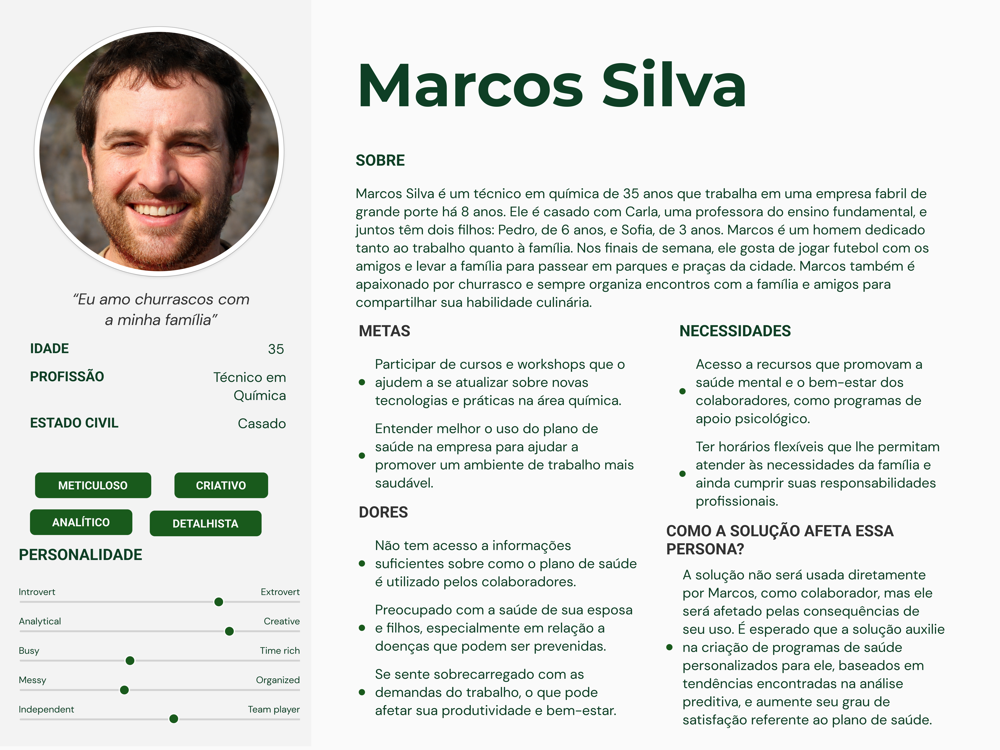
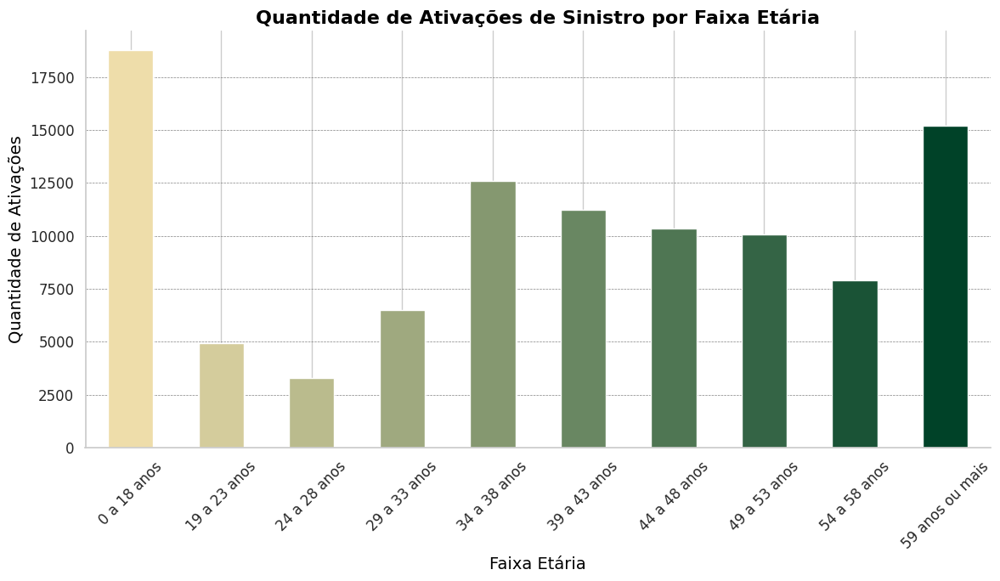
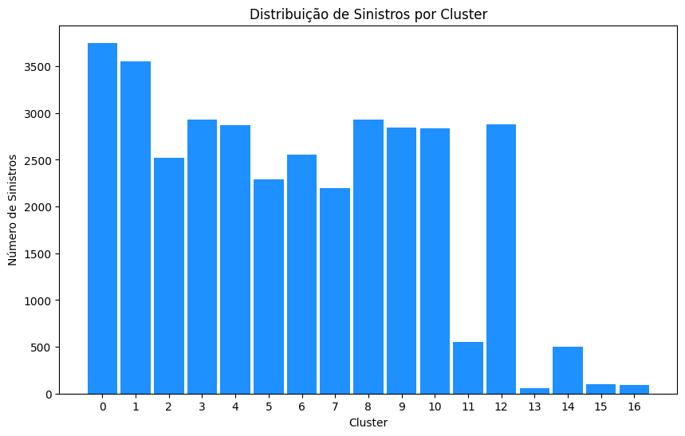

# Documentação Modelo Preditivo - Inteli

## PRISMA 

### Grupo Parrot
#### Cibele Leal, Danilo Merlo, Gabriel Martins, João Rafael, Leonardo Andriolo, Pietra Batista, Vinicius Savian, Yasmin Minário

## Sumário
[1. Introdução](#c1)

[2. Objetivos e Justificativa](#c2)

[3. Metodologia](#c3)

[4. Desenvolvimento e Resultados](#c4)

[5. Conclusões e Recomendações](#c5)

[6. Referências](#c6)


## <a name="c1"></a>1. Introdução

&ensp;O parceiro no desenvolvimento desse projeto será a Unipar, uma empresa criada em 1969, pioneira na implantação de polos petroquímicos e que atualmente presta serviços no Brasil e na Argentina. A empresa tem como principais produções o policloreto de vinila (PVC), sendo a maior produtora da América do Sul, além da produção de cloro e soda cáustica. Com suas produções, eles atingem os setores de saneamento, agricultura, farmacêutico, têxtil e diversos outros.

&ensp;O problema proposto pela empresa está na falta de personalização dos programas de saúde fornecidos aos colaboradores. Seu objetivo é que, por meio de uma análise preditiva da base de dados, seja possível mapear perfis de uso do plano de saúde, perfis esses que ajudarão a Unipar a desenvolver futuramente programas de prevenção que possam diminuir a visita frequente aos médicos.

## <a name="c2"></a>2. Objetivos e Justificativa
### 2.1 Objetivos

&ensp;Os objetivos dentro de um projeto são fundamentais para direcionar e orientar todas as atividades que serão realizadas. Eles servem como um guia que define o que se pretende alcançar com a execução do projeto, estabelecendo uma linha clara entre o ponto de partida e o resultado esperado¹. Os objetivos podem ser classificados em gerais e específicos. O objetivo geral descreve a finalidade ampla do projeto, enquanto os objetivos específicos detalham as etapas ou resultados concretos que contribuirão para o alcance do objetivo geral.

&ensp;A definição clara de objetivos é muito importante, pois permite que a equipe mantenha o foco e a motivação, além de facilitar a avaliação do progresso e do sucesso do projeto. Para garantir que os objetivos sejam eficazes, eles devem ser formulados de maneira específica, mensurável, alcançável, relevante e temporal (SMART)². Essa estrutura ajuda a evitar ambiguidades e a assegurar que todos os envolvidos compreendam o que se espera deles ao longo do processo.

&ensp;Além disso, a elaboração de objetivos bem definidos não apenas orienta as ações da equipe, mas também comunica aos *stakeholders* a importância e a relevância do projeto, aumentando a probabilidade de apoio e recursos necessários para sua execução.

- **Objetivo Geral**

&ensp;O objetivo geral do projeto é desenvolver um modelo preditivo para análise de tendências com a finalidade de apoiar a avaliação e gerenciamento dos dados de saúde dos colaboradores da Unipar. Esta solução permitirá a criação de programas e planos de ação personalizados e direcionados, visando melhorar a saúde e o bem-estar dos colaboradores de forma eficiente e adaptada às suas necessidades específicas, mas sem deixar de abranger a toda a população da fábrica.

- **Objetivos Específicos**

&ensp;**Segmentação e Personalização:** Desenvolver uma metodologia para segmentar a população da Unipar com base em critérios demográficos e comportamentais, permitindo a personalização de programas de saúde sem perder a escalabilidade.

&ensp;**Integridade de Dados:** Assegurar que os dados sejam anonimizados e estruturados de acordo com as diretrizes da LGPD (Lei Geral de Proteção de Dados).

&ensp;**Seleção de Parâmetros:** Realizar a seleção de *features* (variáveis preditoras) mais relevantes para os modelos, utilizando técnicas como correlação, testes estatísticos e algoritmos de seleção automática.

&ensp;**Engenharia de Features:** Aplicar técnicas de engenharia de *features* para criar novas variáveis a partir dos dados existentes, potencializando o poder preditivo dos modelos.

&ensp;**Avaliação de Modelos Preditivos:** Utilizar métricas de avaliação como *Silhouette Score*, *Davis-Bouldin Index* e *Calinski-Harabasz Index* para medir a performance dos modelos e identificar áreas de melhoria. Comparar diferentes abordagens/modelos (*K-Means*, *DBSCAN*, *Fuzzy C Means*, por exemplo) para selecionar o modelo que oferece o melhor desempenho.

&ensp;**Otimização:** Ajustar hiperparâmetros, utilizando *Random Search* e *Grid Search*, dos modelos para otimizar o desempenho preditivo, buscando aprimorar a clusterização.

&ensp;**Tratamento de Desequilíbrios nas Classes:** Abordar problemas de desequilíbrio nas classes (alta sinistralidade versus baixa sinistralidade) utilizando técnicas como reamostragem (*oversampling*/*undersampling*) ou aplicação de penalidades em algoritmos de *machine learning*.

&ensp;**Documentação e Padronização dos Modelos:** Documentar cada etapa do desenvolvimento dos modelos, incluindo a escolha das *features*, justificativas para a seleção dos algoritmos, e as metodologias de avaliação utilizadas. Padronizar o processo de criação e treinamento dos modelos para garantir consistência e facilitar futuros refinamentos ou expansões.

&ensp;Com isso, pretendemos desenvolver um modelo preditivo altamente eficiente e que cumpra com tudo o que nos foi proposto inicialmente no TAPI (Termo de Abertura de Projeto do Inteli) e que alcance as expectativas do nosso parceiro.

### 2.2 Proposta de solução

&ensp;A solução desenvolvida pelo grupo será um modelo preditivo não supervisionado, com foco em clusterização utilizando o modelo *DBSCAN* (*Density-Based Spatial Clustering of Applications with Noise*). O objetivo é agrupar dados não rotulados com base em sua densidade. Esses dados, fornecidos pela Unipar, contém informações sobre sinistros no plano de saúde dos colaboradores e, a partir disso, o modelo será capaz de lidar com os *inputs* de forma mais complexa, detectando *outliers* e identificando padrões em regiões de maior concentração dos dados. Através do agrupamento, será possível identificar os principais tipos de sinistros, categorizando-os com base em variáveis como gênero, faixa etária, tipo de serviço utilizado, entre outros. Isso permite uma análise detalhada da relação entre o perfil dos colaboradores e os sinistros.

&ensp; Durante o desenvolvimento da solução, realizaremos um pré-processamento rigoroso dos dados, que incluirá o tratamento de *outliers*, a categorização adequada das colunas e ajustes necessários para garantir a qualidade dos dados. Como o *DBSCAN* não requer uma etapa de treinamento e validação semelhante ao *K-means*, sua eficácia será avaliada baseada na qualidade dos *clusters* formados pelo modelo e na identificação de padrões relevantes nos dados.

&ensp; Esse modelo permitirá à Unipar identificar as principais tendências relacionadas aos sinistros e os grupos de colaboradores que são mais afetados, oferecendo uma visão estratégica sobre sua base de dados. Com os resultados obtidos, a empresa poderá desenvolver programas de saúde personalizados, alinhados às necessidades específicas de seus colaboradores.

### 2.3 Justificativa

&ensp;A proposta de desenvolver um modelo preditivo oferece uma abordagem muito boa para a gestão de saúde corporativa. Ao categorizar os sinistros, o modelo permitirá uma análise detalhada dos principais eventos que acontecem, dando insights importantes sobre as áreas que exigem maior atenção. Isso facilita a identificação de padrões e tendências que podem ser usados para evitar problemas e implementar medidas preventivas, resultando em uma gestão de saúde mais eficiente. Além disso, essa proposta permitirá à Unipar criar programas de saúde mais bem direcionados, atendendo às necessidades específicas de seus colaboradores.

&ensp;A solução também possibilita um monitoramento contínuo e dinâmico dos sinistros, permitindo que a Unipar acompanhe as mudanças ao longo do tempo e mude suas estratégias de saúde se necessário. Essa capacidade de adaptação é importante em um ambiente corporativo, onde novos desafios e necessidades podem aparecer. Além de melhorar a saúde e o bem-estar dos colaboradores, a proposta pode ajudar a retenção de talentos, já que programas de saúde bem estruturados são um importantes na satisfação e lealdade dos funcionários.

&ensp;Por fim, a utilização de um modelo preditivo traz um diferencial competitivo para a Unipar, ao utilizar uma abordagem baseada em dados para a tomada de decisões, aumentando a precisão das intervenções. Ao integrar tecnologia e análise de dados na gestão de saúde, a Unipar se coloca à frente de muitas organizações, demonstrando um compromisso com a saúde dos colaboradores e a sustentabilidade financeira a longo prazo.

## <a name="c3"></a>3. Metodologia

&ensp;O CRISP–DM é uma metodologia muito utilizada em projetos de ciência de dados. A sigla CRISP-DM significa *Cross Industry Standard Process for Data Mining*, que em português é “Processo Padrão Inter-Indústrias para Mineração de Dados”³. 

&ensp;O CRISP-DM é dividido em seis partes. Três delas são etapas que têm como foco a coleta e organização dos dados a serem analisados, e as outras três têm como objetivo a criação do modelo baseado nas etapas anteriores e na colocação deste modelo em prática, testando todo o trabalho anterior e validando-o, mas, caso seja necessário, é possível voltar do início e repetir o processo⁴. 

<div align="center">
<sub>Figura 1 - CRISP-DM</sub>


<sup>Fonte: IBM (2023)</sup>
</div>

&ensp;As três primeiras etapas são: Entendimento do Negócio, Entendimento dos Dados e Preparação dos Dados. A etapa de Entendimento do Negócio é extremamente importante, pois, se não for feita corretamente, todo o projeto pode ser invalidado, considerando que é nessa etapa que definimos o objetivo do projeto e as necessidades da empresa ou projeto em análise. Em seguida, temos a etapa de Entendimento dos Dados, na qual começamos a pensar nos dados que serão utilizados no processo e realizamos a sua coleta. Na próxima etapa, a de Preparação dos Dados, nós organizamos esses dados, realizamos o tratamento de valores nulos, verificamos se existem *outliers* e fazemos a limpeza da base de dados. 

&ensp;As três últimas etapas são: Modelagem, Avaliação e Implementação. Na Modelagem, é necessário escolher qual o modelo que faz mais sentido com o projeto. Ele é definido a partir do entendimento do negócio que foi realizado, pois deve-se levar em consideração a necessidade do projeto e também o tipo de variável que deve ser analisada. Em seguida, temos a Avaliação do modelo, onde avaliamos se ele atende às necessidades e expectativas do projeto. Caso a resposta seja negativa, todas as forças devem ser direcionadas para fazer as mudanças necessárias, como a retirada de atributos estatisticamente insignificantes, correção na entrada de dados, ajustes no tratamento dos atributos, etc. Após finalizado todo o processo, temos a Implementação, também conhecida como *deployment*, etapa em que o modelo é colocado em produção, ou seja, ele é aplicado para realizar o objetivo desenhado no processo de entendimento do negócio pelo time.

&ensp;O objetivo por trás da metodologia CRISP-DM é desenvolver uma análise eficiente de informações e dados do negócio, para o desenvolvimento de soluções que usufruem do principal benefício do CRISP-DM que, diferentemente de outras metodologias de mineração de dados, propõe uma integração entre a criação do modelo e o profundo entendimento do negócio, garantindo que as soluções sejam alinhadas às necessidades e desafios específicos da organização⁵.

## <a name="c4"></a>4. Desenvolvimento e Resultados
### 4.1. Compreensão do Problema
#### 4.1.1. Contexto da indústria 

&ensp;A indústria química é um dos setores mais importantes para a economia brasileira, representando em torno de 10% do Produto Interno Bruto (PIB) industrial do país, e se destacando globalmente, ocupando o sexto lugar no ranking mundial⁶. A indústria cloro-soda e PVC  é caracterizada por sua diversidade, fornecendo insumos para múltiplos setores, sendo fundamental para indústrias de saneamento, construção civil, alimento, saúde, mineração, papel e celulose, limpeza, farmacêuticos, entre outros. Por abranger diversos setores, a indústria química, especialmente no território nacional, contribui para o desenvolvimento econômico, na medida em que fundamenta muitos desses setores, e tecnológico, uma vez que seus players têm de buscar por inovação nessa área. No entanto, existe uma dependência na exportação de matérias-primas, fazendo com que esse setor esteja em desvantagem em comparação com as indústrias internacionais⁷.

#### **Concorrência:**

&ensp;Um dos maiores desafios que o setor de indústrias químicas do mundo todo enfrenta é a competitividade acirrada. No Brasil, empresas como Unipar Carbocloro, Braskem, Dow Brasil e BASF têm grande participação e capacidade de produção, sendo consideradas líderes desse mercado⁸. Apesar de cada empresa ser reconhecida pela sua especialidade, a Unipar na produção de soda e cloro e Braskem na produção de resinas termoplásticas, por exemplo, a concorrência se dá, principalmente, pela capacidade de inovação e investimentos em tecnologia e práticas sustentáveis, visando melhorias na eficiência produtiva e na redução de custos. No entanto, a competitividade é ainda mais desafiadora quando comparada ao mercado internacional. Apesar de existir um regime especial (REIQ) que objetiva a compensação da disparidade de custos entre as indústrias nacionais e internacionais, de acordo com a Associação Brasileira da Indústria Química (Abiquim), o custo com matérias-primas é, aproximadamente, 4 vezes maior se comparado com outros países, além de que os impostos cobrados no Brasil variam entre 40% a 45%, em comparação aos 20% a 25% nos EUA e Europa⁹. Ainda assim, a indústria química brasileira continua se destacando mundialmente, sendo considerada uma importante exportadora de produtos químicos e, o investimento que as empresas realizam atualmente em inovação e tecnologia, são essenciais para aumentar sua competitividade.

#### **Modelo de Negócio:**

&ensp;O modelo de negócios das indústrias químicas geralmente gira em torno da produção e comercialização de insumos. Empresas como a Unipar, por exemplo, extraem suas matérias-primas, fabricam seus produtos e os vendem para múltiplos setores industriais do mercado. Além disso, utilizam da economia de escala ao investirem em indústrias que fabricam em larga escala, com o objetivo de reduzir custos à medida que a produção aumenta, fazendo mais com menos. Outra maneira que os *players* ganham dinheiro é pela diversificação de produtos. A maioria das indústrias químicas produzem uma grande diversidade de produtos que atendem diferentes tipos de segmentos, como os de construção civil, agricultura, papel e celulose, entre outros e, portanto, variam suas fontes de receita. Ao otimizar esses aspectos, essas empresas conseguem maximizar suas margens de lucro e se manterem competitivas no mercado global.

#### **Tendências:**

&ensp;As tendências de mercado são os comportamentos e movimentos que estão em alta que podem influenciar e impactar o setor do negócio¹⁰. Estar constantemente atento às mudanças é um passo essencial para se adaptar ao que está por vir e aproveitar, de maneira estratégica, as oportunidades, permanecendo relevante perante ao mercado e aumentando a competitividade. Considerando o setor das indústrias químicas, a principal tendência que é possível identificar é a crescente demanda por práticas sustentáveis, principalmente a transição para energias renováveis. Segundo o presidente da BASF da América do Sul, Manfredo Rübens, “um estudo do LinkedIn indicou um aumento nas contratações que têm como prioridade a sustentabilidade, no entanto, apenas 1 em cada 8 trabalhadores no mundo tem uma ou mais green skills (habilidades verdes)”, evidenciando que focar em reduzir impactos ambientais é uma oportunidade para consolidar a posição do Brasil como líder global, elevando sua vantagem competitiva¹¹. A Unipar Carbocloro é um exemplo de empresa que já investe em energias renováveis e tem como objetivo migrar seu consumo para 60% de energia elétrica de fonte sustentável¹². Outra tendência que está presente hoje no mercado é a economia circular, que busca a reutilização e reciclagem de resíduos e materiais, minimizando o desperdício e impacto ambiental. Com essa prática, além de cumprir regulamentos ambientais, a empresa se beneficia ao ampliar sua reputação no mercado. Sistemas automatizados e lA são megatendências que oferecem uma ampla gama de oportunidades, no contexto das indústrias químicas elas podem ser utilizadas para a otimização das condições operacionais, por exemplo. Essas tendências oferecem às indústrias químicas a oportunidade de inovação e diferenciação no mercado, promovendo sustentabilidade e eficiência operacional.

#### **5 Forças de Porter:**

&ensp;O modelo das Cinco Forças de Porter, desenvolvido por Michael Porter, professor da Harvard Business School, na década de 1970, é uma estrutura amplamente utilizada para a análise setorial do mercado em que uma empresa está inserida. Este modelo permite avaliar a posição competitiva da empresa em relação aos demais participantes do setor. Conforme mencionado por Joan Magretta, editora de estratégia na Harvard Business Review, "a estrutura das cinco forças explica os preços e custos médios do setor e, portanto, a lucratividade média a ser superada"¹³. Compreender profundamente a rivalidade entre concorrentes, a ameaça de novos entrantes, o poder de barganha dos fornecedores, o poder de barganha dos clientes e a ameaça de produtos substitutos é essencial para entender a dinâmica competitiva e formular uma estratégia empresarial que vise à maximização do lucro.¹⁴

<div align="center">
<sub> Figura 2 - 5 Forças de Porter </sub>
<br>

<br>
<sup> Fonte: WIKIPÉDIA. Cinco forças de Porter. (Disponível em: https://pt.wikipedia.org/wiki/Cinco_forças_de_Porter. Acesso em: 15 ago. 2024.) </sup>
</div>

#### **1. Ameaça de Novos Entrantes**

**Barreiras de Entrada:**
- **Escalabilidade:** A Unipar possui uma escala de produção muito vasta, o que dificulta a entrada de novos concorrentes, que precisariam investir pesadamente para competir em termos de volume e custo.
- **Capital Intensivo:** A indústria química e petroquímica é altamente capital intensiva, exigindo grandes investimentos em infraestrutura, pesquisa, desenvolvimento, e conformidade de regulamentações ambientais, além da compliance habitual de uma empresa.
- **Regulamentação:** Há fortes regulamentações ambientais e de segurança que novos entrantes precisam superar, o que pode ser um impedimento significativo.
- **Qualidade:** A Unipar se destaca no que tange à entrega de qualidade para seus clientes, uma vez que já é uma empresa consolidada no mercado e 
possui uma ampla gama de clientes que validam essa qualidade, o que pode ser difícil de ser alcançada por uma empresa mais jovem.

&ensp;Portanto, a ameaça de novos entrantes é relativamente baixa devido às altas barreiras de entrada, problemas com escalabilidade, necessidades de capital intensivo, rigorosas regulamentações e a dificuldade de conquistar os clientes e fidelizá-los por meio da qualidade.

#### **2. Poder de Negociação dos Fornecedores**
**Fatores Determinantes:**
- **Concentração de Fornecedores:** O mercado de insumos, como o hipoclorito de sódio e soda cáustica, é relativamente concentrado. A Unipar, que depende fortemente desses insumos, enfrenta uma situação em que poucos fornecedores dominam o mercado. Isso aumenta o poder de barganha dos fornecedores, especialmente em um cenário onde a demanda por produtos químicos está em crescimento devido aos investimentos em infraestrutura e saneamento, como indicado pelo Novo Marco Legal do Saneamento.

- **Custo de Importação:** O Brasil é um importador de soda cáustica, e os custos de importação são elevados devido ao frete e à natureza do produto, que é frequentemente transportado em solução. Isso torna a dependência de fornecedores locais ainda mais crítica, já que a importação não é uma alternativa viável para a Unipar. A estrutura de custos de importação, que inclui frete e seguro, torna a oferta local mais competitiva, reforçando a posição dos fornecedores.

&ensp;A Unipar Carbocloro enfrenta um cenário onde o poder de barganha dos fornecedores é elevado devido à concentração do mercado, aos altos custos de importação, à essencialidade dos insumos e à natureza cíclica do setor. Para mitigar esses riscos, a empresa deve considerar diversificar suas fontes de suprimento e investir em parcerias estratégicas, como as *joint ventures*, que possam oferecer maior estabilidade e segurança no fornecimento desses insumos.

#### **3. Poder de Negociação dos Clientes**
**Fatores Determinantes:**
- **Diversidade de Clientes:** A Unipar atende a uma ampla gama de indústrias, desde saneamento até têxtil e farmacêutica, o que diversifica sua base de clientes e diminui o poder de negociação de qualquer cliente individual.
- **Volume de Compras:** Grandes clientes que compram em volumes significativos podem ter maior poder de negociação, exigindo preços mais baixos ou melhores condições.

&ensp;Assim sendo, poder de negociação dos clientes é moderado, pois a diversificação da base de clientes da Unipar equilibra o impacto dos grandes clientes que podem negociar condições mais favoráveis.

#### **4. Ameaça de Produtos Substitutos**
**Fatores Determinantes:**
- **Disponibilidade de Substitutos:** A Unipar produz produtos químicos essenciais como cloro, soda e PVC, que têm poucos substitutos diretos. Pode-se pensar em produtos biodegradáveis que vêm ganhando força, porém um grande problema que eles enfrentam é a escalabilidade.
- **Necessidade do Produto:** Produtos como PVC são essenciais para construção e saneamento, tornando a substituição menos viável sem comprometer a qualidade ou o desempenho.

&ensp;Em conformidade com o exposto, a ameaça de produtos substitutos é baixa, dado que muitos dos produtos da Unipar são base para a construção (entre outras áreas) e têm poucos substitutos viáveis que oferecem a mesma funcionalidade e desempenho.

#### **5. Rivalidade entre Concorrentes**
**Fatores Determinantes:**
- **Número de Concorrentes:** A Unipar compete com outras grandes empresas químicas na América do Sul, como Braskem, o que pode intensificar a rivalidade.
- **Crescimento do Setor:** Em setores com crescimento lento, a rivalidade tende a ser maior devido à competição por participação de mercado.
- **Saturação do mercado:** Sem muitas possibilidades de inovação e sem um investimento pesado em pesquisa tecnológica, o mercado tende a se tornar saturado e seus *players* passam a competir por meio da oferta do menor preço, não mais pela qualidade do produto (também conhecido como oceano vermelho).

&ensp;Pode-se inferir que a rivalidade entre concorrentes é alta, especialmente considerando a presença de grandes players no mercado sul-americano e a necessidade constante de inovação e eficiência para manter a competitividade que entra em conflito com a saturação do mercado.

&ensp;Concluí-se, portanto, que a Unipar está bem posicionada no mercado com fortes barreiras de entrada protegendo sua posição e uma diversificada base de clientes que mitiga o poder de negociação dos clientes. A empresa também enfrenta baixa ameaça de substitutos, embora precise gerenciar cuidadosamente o poder dos fornecedores e a intensa rivalidade do setor. Posto isso, a integração vertical e o investimento contínuo em tecnologia e sustentabilidade são estratégias que podem ser adotadas para manter e fortalecer sua posição competitiva. Por fim, a empresa deve continuamente adaptar suas estratégias para lidar com todos os cenários possíveis.

#### 4.1.2. Análise SWOT 

&ensp;A Matriz SWOT, desenvolvida na década de 1960 por Albert Humphrey, é uma ferramenta de planejamento estratégico muito conhecida pela sua capacidade de auxiliar na identificação de pontos fortes e fracos que estão envolvidos no contexto de uma empresa. A análise das forças (strengths), fraquezas (weaknesses), oportunidades (opportunities) e ameaças (threats), ajuda a compreender quais as competências internas e as condições externas que podem eventualmente impactar a empresa, positiva ou negativamente, e, consequentemente, quais as melhores medidas a serem tomadas para potencializar os pontos fortes e atenuar os fracos¹⁵. 

&ensp;As fraquezas e forças são aspectos considerados do ambiente interno, o que significa que são fatores diretamente controláveis pela empresa. As forças são as características que proporcionam uma vantagem competitiva perante os concorrentes, agregando valor ao negócio. Já as fraquezas englobam tudo aquilo que potencialmente pode limitar a evolução e desempenho da corporação. Por serem elementos de controle direto da empresa, eles podem ser adaptados com mais facilidade para aprimorar o negócio, utilizando novas estratégias.

&ensp;Por outro lado, o ambiente externo compreende os aspectos que estão fora do controle da empresa, mas que ainda assim impactam a sua performance. Entende-se como oportunidades todos os fatores e situações que podem ser aproveitados pela corporação para trazer benefícios e se posicionar mais favoravelmente diante do mercado. As ameaças, em contrapartida, são as situações externas que podem colocar a empresa em uma situação de risco, gerando maiores desvantagens e desafios para um bom desempenho mercantil. Apesar de incontroláveis, são fatores que a empresa deve sempre atentar-se para minimizar impactos negativos e maximizar as vantagens.

&ensp;Ao aplicar a matriz e análise SWOT no projeto com a Unipar Carbocloro, foi possível identificar fatores que impactam a empresa e a indústria química de maneira que muitas vezes não são percebidos de início, como os descritos na imagem abaixo:


<div align="center">
<sub> Figura 3 - Análise SWOT </sub>
<br>

<br>
<sup> Fonte: Material produzido pelos autores (2024) </sup>
</div>

&ensp;A Unipar se destaca no que se diz respeito a investimentos em energias renováveis, fazendo com que esse aspecto seja considerado uma grande força para empresa, levando em consideração que, para a produção de cloro e soda cáustica, o consumo de energia elétrica é alto. Além disso, o compromisso com a sustentabilidade gera diferenciação competitiva e grande valor social, pois demonstra a preocupação da empresa para com o bem-estar da sociedade e meio-ambiente. Analisando o mercado de automóveis, a crescente demanda por veículos elétricos pode significar uma oportunidade para a Unipar de participar do mercado de lítio, visto que, para sua extração, é necessário a utilização de produtos químicos¹⁶.

&ensp;Embora a Unipar seja uma empresa líder na produção de químicos e fornecimento de matérias-primas e referência no mercado, ainda assim é sujeita a fraquezas e ameaças. Segundo a revista Exame¹⁷, em 2022 a Unipar teve um aumento significativo dos custos de produção por conta das despesas administrativas e  de vendas, evidenciando que existe espaço para melhorias em estratégias de redução de custo dentro da empresa. Já as leis e regulamentações ambientais, como o controle de emissões de CO2,  representam uma ameaça ao setor de indústrias químicas, ao considerar que estão em constante revisões para reduzir danos ao meio-ambiente. Conflitos geopolíticos, como os recentes no Oriente Médio, refletem diretamente na cadeia de abastecimento da empresa, acarretando em atrasos nas entregas dos insumos e aumento de preços¹⁸.

&ensp;Apesar da matriz SWOT ser construída a partir de um modelo 2X2, um dos benefícios da análise é desenvolver uma interdependência mais robusta entre os fatores. É possível relacionar os pontos fortes da empresa para potencializar suas forças e maximizar oportunidades. Um exemplo seria utilizar dos investimentos em energias renováveis para atender às crescentes demandas por produtos sustentáveis e expandir sua linha de produtos ao vender as energias que produz, aumentando sua participação no mercado. Por outro lado, a Unipar deve atentar-se às suas fraquezas e ameaças externas para reduzir os impactos negativos que esses fatores podem acarretar ao seu negócio. A dependência de matérias-primas é um aspecto que exemplifica como a flutuação nos preços desses insumos têm um impacto direto nos custos de produção e margens de lucro. Essa análise pode fazer com que a empresa desenvolva novas estratégias de mitigação e de exploração mercantil. Se a Unipar expandir seus serviços para o mercado de lítio e venda de energia renovável, por exemplo, além de reforçar seus pontos fortes, ela atenua os fracos.

&ensp;Após a montagem e análise da matriz SWOT, foi possível identificar elementos importantes que impactam direta e indiretamente a Unipar Carbocloro e a indústria química no geral. Com essa coleta de dados e a interdependência entre os pontos fortes e fracos, a empresa é capaz de definir estratégias e traçar planos de ações mais eficientes, com o objetivo final de fortalecer seu negócio ao mitigar as fraquezas e ameaças e usufruir das forças e oportunidades.


#### 4.1.3. Planejamento Geral da Solução

&ensp;&ensp;A solução que será desenvolvida utilizará os dados disponibilizados pela Unipar, que são informações fornecidas pela Mercer Marsh Benefícios, corretora de saúde da empresa responsável pelo plano de saúde dos funcionários. Os dados são informações sobre os sinistros que foram registrados pela corretora, sendo eles alguns qualitativos (“Elegibilidade Sinistro”, “Sexo Sinistro”,”Descricao Servico Sinistro”, entre outros) e outros, quantitativos (“Dt Data Sinistro”, “Valor Pago Sinistro”, entre outros).

&ensp;&ensp;O grupo propôs desenvolver um modelo preditivo não supervisionado que terá como objetivo analisar a base de dados com as informações dos sinistros do plano de saúde dos colaboradores, identificar padrões e agrupar os sinistros de forma automática, sem o uso de rótulos predefinidos. O modelo buscará criar *clusters* que organizem os dados com base em variáveis como gênero, faixa etária e valor pago no sinistro. Dessa forma, será possível observar tendências emergentes em cada grupo e entender características relevantes sobre as ativações dos sinistros.

&ensp;&ensp;O modelo poderá ser utilizado para que a Unipar possa criar novos programas de saúde mais alinhados com as necessidades dos colaboradores e trará maior satisfação geral dentro da empresa. O principal benefício que será entregue é a diminuição do tempo e o aumento da precisão na análise dos dados, além da redução de custos do plano de saúde. Portanto, os funcionários responsáveis por lidar com essas análises, como analistas de dados ou funcionários das áreas de benefícios e de saúde da empresa, e os próprios colaboradores que fazem parte do plano de saúde da Unipar, serão os principais beneficiados. O critério de sucesso será o modelo que apresentar as melhores métricas de Silhouette Score, Davies-Bouldin e Calinski-Harabasz. 

#### 4.1.4. Value Proposition Canvas

&ensp;De acordo com Patrick Van Der Pijl¹⁹, CEO do Business Models Inc, o Canvas de Proposta de Valor é uma ferramenta utilizada para mapear as características do projeto e as necessidades do cliente, relacionando esses dois aspectos. Essa abordagem permite encontrar o encaixe produto-mercado, sendo escolhido como recurso fundamental para compreender o negócio do projeto. Portanto, assegura-se que a proposta apresentada realmente atenda e solucione as dores do cliente.

<div align="center">
<sub>Figura 4 - Canvas de Proposta de Valor</sub>

<sup>Fonte: Material produzido pelos autores (2024)</sup>
</div>

##### Segmento do Cliente
&ensp;Ao analisar o Segmento do Cliente, mapeou-se as tarefas, dores e ganhos específicos. Primeiramente, foi observado as atividades da equipe que fornece os serviços de saúde para colaboradores. Foi notada uma defasagem nas estratégias para o direcionamento personalizado desses programas. Por exemplo, não havia uma segmentação dos colaboradores com base em suas necessidades de saúde, resultando em falta de direcionamento dos planos de saúde. Essa abordagem gerava custos elevados e desnecessários para a empresa, já que muitos programas não tinham a adesão coerente com o alto investimento. Além disso, o uso de um *dashboard* com dados não relacionados era ineficaz, impossibilitando a geração de *insights*. Diante disso, fica evidente a necessidade de facilitar o direcionamento dos programas de saúde para tornar o processo mais eficiente.

##### Proposta de Valor
&ensp;Ao relacionar esses elementos com a Proposta de Valor, percebe-se que, ao organizar os dados de forma adequada, é possível gerar *insights* sobre o comportamento dos colaboradores. Por exemplo, identificar quais serviços de saúde estão sendo mais utilizados e por quem. Por isso, dados demográficos também são relevantes nessa análise. Além disso, a escalabilidade do projeto é um fator importante a ser considerado, permitindo um uso mais robusto e aumentando a capacidade de ofertar programas de saúde para um maior número de funcionários em menor tempo. Portanto, constatou-se que o desenvolvimento de um modelo preditivo para identificar tendências de comportamento dos colaboradores seria a solução ideal, proporcionando uma base sólida para a tomada de decisões.

&ensp;Em conclusão, a criação de um Canvas de Proposta de Valor para analisar este projeto foi essencial. Ele permitiu que o grupo compreendesse melhor o contexto do cliente e identificasse as dores dos colaboradores que precisam ser solucionadas. Assim, teve-se um melhor direcionamento sobre o que será feito no contexto de desenvolvimento, diminuindo os riscos de fazer uma entrega não condizente com o que é solicitado.

#### 4.1.5. Matriz de Riscos

&ensp;A Matriz de Risco ou Matriz de Probabilidade e Impacto se trata de uma ferramenta de gerenciamento que serve para mapear os riscos que precisam receber mais atenção ao longo do desenvolvimento de um projeto(MINETTO, 2019)²⁰. Esse recurso foi utilizado no projeto para poder esquematizar as possíveis situações e antecipar o plano de ação, minimizando o impacto.

##### Ameaças
<div align="center">
<sub>Figura 5 - Matriz de Ameaças</sub>

<sup>Fonte: Material produzido pelos autores (2024)</sup>
</div>

**Risco 01:** Banco de dados incondizente com o projeto

* Contexto: Para extrair as informações necessárias para criação de um modelo preditivo, os parceiros sugeriram no TAPI (Termo de Abertura do Projeto Inteli), certos tipos de dados a serem destacados na hora da criação entre esses elementos, como o comportamento dos colaboradores. Porém, no banco de dados, não consta essas informações. 
* Plano de ação: Questionar e entender as expectativas exatas da Unipar em relação aos resultados do projeto e quais dados devem ser utilizados para melhor aproveitar seu uso com objetivo de atender a proposta de solução.

**Risco 02:** Erro no entendimento da proposta

* Contexto: Por conta de uma má comunicação com a empresa e uma interpretação ineficaz do documento por ela disponibilizado, é possível que o grupo não compreenda exatamente o que foi proposto e acabe tendo que readaptar o projeto futuramente, atrapalhando a cronologia de tarefas ao longo do desenvolvimento. 
* Plano de ação: Estabelecer uma comunicação clara e validar todas as partes que necessitem de confirmação, além de questionar os elementos do projeto que ainda não foram totalmente esclarecido.

**Risco 03:** Dados mal estruturados

* Contexto: Ao receber um banco de dados para usá-lo para análise, é necessário fazer uma limpeza, retirando dados incoerentes ou espaços vazios. Porém, uma estrutura de dados com muitos dados apagados ou alterados se torna ineficiente ao não demonstrar a veracidade das informações que estão sendo produzidas e pode treinar o modelo de forma equivocada. A partir disso,  O modelo preditivo tem chances de obter um nível de desempenho não satisfatório, tornando-o inoperante.
* Plano de ação: Manter comunicação com o cliente sobre o status do banco de dados e pensar em diferentes análises que possam ser feitas com os dados disponíveis, com diferentes variáveis e modelos, tentando alcançar o solução proposta.

**Risco 04:** Ocorrência de compromissos externos

* Contexto: Caso os membros do grupo precisem passar por compromissos pessoais não relacionados ao projeto, mas que acabem atrapalhando no planejamento de horários que as tarefas serão feitas, é possível que nosso projeto tenha atrasos e comprometa a entrega final. 
* Plano de ação: Sempre manter a comunicação honesta entre membros do grupo em casos de ausência ou impedimentos diversos.


##### Oportunidades

<div align="center">
<sub>Figura 6 - Matriz de Oportunidades</sub>

<sup>Fonte: Material produzido pelos autores (2024)</sup>
</div>

*** Risco 05:** Bom aproveitamento da linguagem Python

&ensp;Além de ser uma linguagem bastante simples de ser utilizada, também é versátil por possuir diversas bibliotecas (como Pandas e Numpy) ideais para serem utilizadas no desenvolvimento de modelos preditivos. Por isso, ele se prova como sendo uma linguagem passível de ser usada no projeto de forma muito proveitosa. Para aproveitar ainda mais os benefícios do Python, é importante que todos do grupo tenham uma noção de sua grande variedade de funções.

*** Risco 06:** Rápido entrosamento entre os membros do grupo

&ensp;A partir do momento que o grupo conseguir se entrosar e estabelecer uma boa relação entre si, a comunicação funcionará de forma eficaz, trazendo uma série de benefícios: menos retrabalho, resolução mais rápida de conflitos e mais produtividade. Todas essas questões contribuem para um desenvolvimento mais fluído, rápido e com menos empecilhos. 

*** Risco 07:** Encontros esclarecedores com os parceiros

&ensp;Se uma boa comunicação for estabelecida com os parceiros todos os encontros serão muito valiosos para garantir um encaminhamento correto ao longo do projeto. Assim, será desenvolvido um produto que realmente solucionará as dores que foram trazidas pela empresa. Para garantir que essa troca seja eficaz, é necessário fazer constantes análises do projeto para realizar perguntas realmente pertinentes.

&ensp;A partir das análises feitas a partir desse material, o grupo entendeu que a comunicação eficaz é essencial para o sucesso do projeto e para evitar mal-entendidos. Garantir trocas constantes entre o grupo e com os parceiros ajuda a mitigar riscos e a aproveitar oportunidades, tornando o desenvolvimento mais fluido e produtivo, além de otimizar recursos.

#### 4.1.6. Personas
&ensp;As personas são representações fictícias do usuário ideal, baseadas em dados reais sobre comportamentos e características demográficas. Elas são fundamentais para entender as necessidades, motivações e desafios do público-alvo, permitindo o desenvolvimento de soluções mais eficazes e direcionadas. Sua importância reside na capacidade de guiar decisões estratégicas, desde o design até o marketing, assegurando que cada aspecto do projeto ressoe com os usuários e, consequentemente, melhore a experiência deles e promova um engajamento mais profundo²¹.

&ensp;De acordo com Page Laubheimer²², existem três formas diferentes de criar uma persona, dependendo da quantidade de dados que se possui:
- Proto-personas: criadas para alinhar rapidamente as suposições existentes da equipe sobre quem são seus usuários;
- Personas qualitativas: baseadas em pesquisas qualitativas de uma pequena amostra, como entrevistas, testes de usabilidade ou estudos de campo;
- Personas estatísticas: criadas a partir da coleta de um grande tamanho de amostra e através de análise estatística.

&ensp;Considerando os tipos citados anteriormente e a quantidade de dados disponíveis, o projeto atual utilizará proto-personas devido à disponibilidade limitada dos dados e ao tempo restrito do projeto.

&ensp;Assim, foram identificadas três personas para o projeto: duas que farão uso do modelo preditivo (gerente de recursos humanos e analista de dados) e uma que será afetada por ele (colaborador). A persona 3, o colaborador, representa qualquer funcionário da Unipar. Vale destacar que as personas são um recurso essencial para definir as _User Stories_. As figuras a seguir descrevem as personas que utilizaremos em nosso projeto:

<div align="center">
<sub> Figura 7: Persona 1 - Ana Paula, Gerente de Recursos Humanos </sub>
<br>

<br>
<sup> Fonte: Material produzido pelos autores (2024) </sup>
</div>

<div align="center">
<sub> Figura 8: Persona 2 - Roberta Paiva, Analista de Dados </sub>
<br>

<br>
<sup> Fonte: Material produzido pelos autores (2024) </sup>
</div>

<div align="center">
<sub> Figura 9: Persona 3 - Marcos Silva, Técnico em Química </sub>
<br>

<br>
<sup> Fonte: Material produzido pelos autores (2024) </sup>
</div>

&ensp;Como mencionado anteriormente, as personas 1 e 2 (gerente de recursos humanos e analista de dados) utilizarão o modelo de análise preditivo. No entanto, não seria produtivo tentar criar um modelo que atendesse às necessidades de ambas simultaneamente, pois elas possuem demandas distintas: a gerente de recursos humanos busca *insights* que auxiliem na tomada de decisões estratégicas, enquanto a analista de dados deseja ter acesso a dados detalhados e a capacidade de realizar análises aprofundadas.

&ensp;Dessa forma, decidimos tratar a persona focal de nosso estudo como sendo a gerente de recursos humanos (persona 1), desenvolvendo um modelo mais especializado em buscar padrões e tendências que atendam às suas necessidades. Caso a entrega do _Minimum Viable Product_ (MVP), ou Mínimo Produto Viável, seja realizada antes do fim do planejamento do cronograma, há a possibilidade de desenvolver de um *dashboard* com mais análises para atender à analista de dados (persona 2).

&ensp;Por outro lado, a persona 3 (colaborador) será afetada pelas ações tomadas baseadas no modelo de análise preditiva. Os impactos dessas ações podem ser positivos ou negativos. Espera-se que a solução possa levar a uma personalização dos programas de saúde ofertados aos colaboradores, permitindo que a empresa proporcione cuidados mais adequados às suas necessidades individuais, o que pode resultar em uma melhoria na saúde geral dos mesmos, aumentando sua satisfação e produtividade. Por outro lado, se os dados forem mal interpretados, utilizados de maneira inadequada ou para finalidades que não beneficiem os colaboradores, isso pode resultar em decisões prejudiciais, como a exclusão de colaboradores de determinados benefícios de saúde ou, em casos extremos, até mesmo o desligamento de funcionários considerados de alto risco.

&ensp;Por fim, a utilização de personas visa atender às necessidades do público-alvo de forma eficaz. Essas representações fictícias ajudam as equipes a compreender os comportamentos e desafios dos usuários, resultando em decisões de design mais informadas e acertadas. Além disso, as personas melhoram também a comunicação entre a equipe e os _stakeholders_, alinhando todos em torno de um entendimento comum.

#### 4.1.6.1 User Stories
&ensp;Segundo Willian Stigliani, Gerente de Produtos da MOSE, “User Story (ou história do usuário) é uma frase curta e simples que descreve uma funcionalidade do ponto de vista do usuário, utilizada para informar e inspirar decisões de design”, ou seja, ela serve para orientar idealizadores e desenvolvedores a atender as necessidades reais dos usuários, garantindo que o projeto siga de forma alinhada aos seus objetivos²³.

&ensp;As *user stories* são essenciais para garantir que o desenvolvimento seja focado no valor entregue ao usuário final. Elas costumam seguir o formato: "Como [tipo de usuário], eu quero [realizar tal ação] para que [benefício ou resultado esperado]." Esse formato ajuda a contextualizar a funcionalidade dentro do fluxo de trabalho ou problema do usuário, permitindo que a equipe de desenvolvimento priorize e desenvolva soluções que realmente atendam suas necessidades.

&ensp;No nosso caso, focamos em entender a perspectiva do gerente de recursos humanos da Unipar, que é o público-alvo do nosso modelo. Isso nos ajudou a identificar quais são suas principais dores e quais funcionalidades seriam mais úteis para resolver seus problemas. Com essa compreensão, conseguimos direcionar melhor o desenvolvimento do projeto e definir as *features* necessárias para atender a essas demandas, garantindo que estamos criando uma solução que agregue valor ao usuário.

&ensp;Essas *user stories* ajudaram a definir as funcionalidades essenciais do nosso modelo, considerando as necessidades do gerente de recursos humanos. A seguir, apresentamos tabelas com as *user stories* e seus respectivos critérios de aceite. A primeira tabela se trata da *user story* sobre o formato no qual essas informações serão recebidas pelo gerente.

&nbsp;&nbsp;&nbsp;&nbsp;
| Identificação | US1 |
|----------|----------|
| Descrição  | Acesso ao Modelo de Análise Preditiva|
| Persona  | Ana Paula|
| *User story*  | **Como** uma gerente de recursos humanos, **eu quero** ter acesso a um *notebook* / modelo de análise preditiva intuitivo, **para** que eu possa prever tendências de saúde e comportamento dos colaboradores.|
| Critérios de aceite  | <ul><li>O modelo é apresentado em formato de *notebook*.</li><li>O modelo fornece *notebook* claro e compreensível sobre as tendências do perfil de colaborador.</li></ul>


&ensp;A próxima *user story* foca na necessidade de agrupar colaboradores com base em dados de saúde.

&nbsp;&nbsp;&nbsp;&nbsp;
| Identificação | US2 |
|----------|----------|
| Descrição  | Agrupamento de Categorias de Colaboradores|
| Persona  | Ana Paula|
| *User story*  | **Como** uma gerente de recursos humanos, **eu quero** agrupar categorias de colaboradores com base em seu perfil sobre dados de saúde, **para** que eu possa identificar grupos com necessidades específicas e direcionar programas de saúde personalizados. |
| Critérios de aceite  | <ul><li>O modelo deve fornecer dados segmentados de colaboradores com base em critérios definidos (idade, histórico de saúde, etc.).</li><li>A visualização dos grupos deve ser intuitiva e fácil de entender.</li></ul>


&ensp;Por fim, o monitoramento contínuo dos indicadores de saúde é crucial para ações proativas.

&nbsp;&nbsp;&nbsp;&nbsp;
| Identificação | US3 |
|----------|----------|
| Descrição  | Monitoramento Contínuo de Indicadores de Saúde|
| Persona  | Ana Paula|
| *User story*  | **Como** uma gerente de recursos humanos, **eu quero** monitorar com frequência os indicadores de saúde dos colaboradores, **para** que eu possa identificar com agilidade quaisquer mudanças ou problemas emergentes e agir proativamente. |
| Critérios de aceite  | <ul><li>A solução deve gerar atualizações  periódicas nos *notebooks* para mudanças significativas nos indicadores de saúde.</li><li>Deve ser possível visualizar tendências através de *notebooks* periódicos.</li><li>A ferramenta deve permitir a comparação entre diferentes períodos e grupos para facilitar a identificação de padrões.</li></ul>


&ensp;Ao longo do desenvolvimento do projeto, entender as necessidades do público-alvo foi essencial para definir as funcionalidades mais relevantes e que estariam de fato no projeto. As *user stories* nos ajudaram a manter o foco nas soluções práticas, permitindo criar um modelo que seja útil no dia a dia do usuário. Esse processo nos mostrou a importância de alinhar o desenvolvimento à experiência do usuário para que possa haver ferramentas que sejam eficazes para resolver os problemas reais do público-alvo.

#### 4.1.7. Jornadas do Usuário

&ensp;As Jornadas do Usuário são todos os processos que o usuário enfrenta ao utilizar um produto ou serviço, passando por variados pontos de contato e interações. Essas jornadas são comumente utilizadas no UX Design para delinear um mapa da experiência do usuário com esse produto ou serviço, sempre analisando o usuário como o protagonista dessa jornada. Dessa forma, para o UX Designer, é possível unir Storytelling e Visibilidade e, assim, melhorar a experiência do usuário sem tirá-lo de foco²⁴.

&ensp;Para se construir um bom mapa de jornada de usuário é importante que haja uma análise a respeito de quem é o ator, suas ações, pensamentos e emoções; estabelecer o cenário do seu usuário e a experiência pela qual ele está passando, os pontos de contato do usuário com o produto ou serviço e, enfim, extrair *insights* a partir das informações levantadas. Sendo assim, é seguro dizer que os mapas de jornada do usuário contam com os seguintes elementos-chave: ator, cenários e expectativas, fases da jornada, ações, mentalidades e emoções e, por fim, oportunidades e responsabilidades.


&ensp;Configura-se como ator a persona ou usuário específico que passa pela jornada, ou seja, o mapa da jornada do usuário deve partir do ponto de vista do ator e descrever suas ações, objetivos, pensamentos e emoções²⁵. Nosso ator é a Ana Paula, uma gerente de recursos humanos que vivencia um cenário em que precisa desenvolver programas de saúde que atendam melhor os colaboradores. Ela busca uma ferramenta que possa auxiliá-la. As expectativas de Ana Paula são que ao usar essa ferramenta, ela seja capaz de acessar relatórios que ajudem na tomada de decisão e a ajudem a despender menos tempo para criar programas de saúde personalizados para os colaboradores e, assim, melhorar a saúde e bem-estar deles. A determinação e descrição do ator nos ajuda a compreender melhor o usuário e, assim, desenvolver uma ferramenta que atenda às suas dores.

&ensp;Imergindo de forma mais aprofundada na Jornada do Usuário, o próximo passo foi idealizar suas fases. A sequência escolhida inclui as seguintes etapas: Perceber, Buscar, Avaliar, Desenvolver, Aplicar e Monitorar. Ela foi estruturada para garantir uma abordagem progressiva, sistemática e centrada no usuário.

&ensp;Cada etapa é composta por elementos fundamentais que descrevem a experiência e as possíveis decisões de Ana Paula. As **ações** representam o que ela faz em cada fase, enquanto o **mindset** reflete sua mentalidade e abordagem em relação aos desafios enfrentados. As **emoções** capturam como ela se sente durante o processo, desde a frustração até a empolgação. As **oportunidades** destacam as possibilidades que surgem em cada ponto de contato, enquanto as **responsabilidades** definem os compromissos assumidos por quem oferece o produto ou serviço. Por fim, os *insights* indicam novas perspectivas sobre a situação, permitindo um refinamento contínuo da estratégia adotada. Esses elementos interagem de forma dinâmica e moldam a jornada.


<div align="center">
<sub> Figura 10: Jornada de Usuário de Ana Paula</sub>
<br>

<br>
<sup> Fonte: Material produzido pelos autores (2024) </sup>
</div>

&ensp;A jornada de usuário de Ana Paula começa com a necessidade de melhorar os programas de saúde dos colaboradores utilizando um modelo preditivo. Desde o início, Ana Paula percebe que o modelo pode fornecer perfis detalhados com base em características dos colaboradores, facilitando a criação de programas personalizados. Ela recebe informações da equipe e revisa as ferramentas já disponíveis para garantir que o uso do modelo preditivo é a melhor escolha. Na fase de desenvolvimento, ela trabalha diretamente com a equipe técnica para organizar os dados e ajustar o modelo, certificando-se de que ele está alinhado às suas necessidades. Depois, aplica os perfis gerados em programas de saúde personalizados, garantindo que toda a equipe esteja treinada para interpretar e utilizar os dados corretamente.

&ensp;Os principais *insights* da jornada destacam a importância de uma capacitação contínua para a equipe. Treinamentos interativos e feedback constante durante o desenvolvimento são cruciais para garantir que os colaboradores entendam o valor do modelo preditivo e saibam usá-lo adequadamente. Além disso, foi identificado que, ao monitorar a aplicação dos programas, um *dashboard* para visualização de dados pode ser uma ferramenta bastante útil, facilitando a interpretação de informações, o que tornará o processo mais eficiente.

&ensp;Esse exercício nos indicou que devemos continuar desenvolvendo a solução com foco em usabilidade para que ela realmente faça a diferença na rotina de quem vai utilizá-la. A jornada também nos forneceu *insights* de que a implementação de um sistema de *feedback* contínuo e de ferramentas de visualização de dados podem ser oportunidades para serem aproveitadas no futuro por Ana Paula e outros colaboradores que fazem parte da área de Recursos Humanos. Então, essa parte pode ser desenvolvida, mas nós não a faremos nesse projeto.


#### 4.1.8 Política de Privacidade
&ensp;A política de privacidade, ou Termos e Condições de Segurança, é um documento que visa garantir a transparência das práticas e processos de um controlador no uso dos dados fornecidos pelo titular. Este documento precisa estar de acordo com a Lei Geral de Proteção de Dados (LGPD). Para isso, a LGPD estabelece que a política de privacidade deve incluir informações gerais sobre a pessoa natural ou jurídica responsável pelo armazenamento dos dados, quais dados pessoais são coletados, inclusive os que não são informados pelo usuário, onde os dados são coletados, a finalidade dessa coleta, onde e por quanto tempo serão armazenados, o uso de cookies ou tecnologias semelhantes, com quem os dados serão compartilhados, as medidas de segurança adotadas para proteger essas informações, como os direitos do titular são garantidos e como ele pode exercê-los, além de informações sobre o *Data Protection Officer* (DPO), responsável pela proteção de dados²⁶.

&ensp;De acordo com a política de privacidade da Unipar²⁷, descrevemos a seguinte política de privacidade:

Última atualização: Agosto 2024.

&ensp;A UNIPAR, pessoa jurídica de direito privado, com sede na Avenida Presidente Juscelino Kubitschek, 1327 – 22º andar São Paulo – SP – Brasil CEP 04543-011, inscrita no CNPJ/MF sob o nº 33.958.695/0001-78 (doravante “Unipar” ou “Nós”), leva a sua privacidade a sério e zela pela segurança e proteção de dados de todos os seus clientes, parceiros, fornecedores e usuários (“Usuários” ou “Você”) afetados por esse projeto (doravante “Projeto”) ou qualquer outro site e aplicativo operado pela UNIPAR, na qualidade de controladora de dados.

&ensp;Esta política ilustra como a Unipar, diretamente ou através de suas afiliadas, trata dados pessoais dos Usuários de acordo com a Lei No. 13.709/2018 (Lei Geral de Proteção de Dados Pessoais – “LGPD”), e como esses dados são usados, compartilhados e como podem ser acessados, alterados ou excluídos. Como prova de seu compromisso em relação à privacidade, a Unipar definiu esta política no âmbito mais amplo de um modelo de gerenciamento de privacidade, para garantir o seu total cumprimento como base da cultura da empresa. Todos os dados pessoais fornecidos por Você, através do Contrato de Trabalho, são usados exclusivamente para os objetivos descritos abaixo.

<br>

**Quais categorias de dados pessoais a Unipar coletará sobre mim e como esses dados são coletados?**

&ensp;“Dado pessoal” significa qualquer informação relativa a Você. A Unipar coletará, tratará e utilizará as seguintes categorias e tipos de dados pessoais sobre Você:<br>
- Dados de identificação, tais como seu nome, sobrenome, CPF, RG;
- Informações pessoais, como data de nascimento e gênero;
- Dados de contato, como seu endereço de e-mail, endereço residencial, telefone residencial, celular e Estado de residência;
- Dados profissionais, como empresa em que trabalha, departamento, cargo, endereço comercial, telefone comercial, e/ou nome da sua instituição de ensino;
- Dados sobre suas preferências, como conteúdo que Você tenha interesse em receber, áreas de interesse, seu perfil;
- Dados sobre seu uso dos nossos serviços, inclusive endereço de IP, data e hora do acesso;

**Os seus dados pessoais são coletados a partir das seguintes fontes:**<br>
- Dados que Você nos fornece diretamente, ao preencher campos de cadastro ou formulários no Site, ou entrar em contato conosco; e
- Informações obtidas mediante sistemas de rastreamento automático ao usar o Site e seus serviços.

<br>

**Quais categorias de dados sensíveis a Unipar coletará sobre mim e como esses dados são coletados?**

&ensp;Dado pessoal sensível significa qualquer informação relativa a Você que revelam "origem racial ou étnica, convicções religiosas ou filosóficas, opiniões políticas, filiação sindical, questões genéticas, biométricas e sobre a saúde ou a vida sexual. Para o Usuário contemplado pelo serviço de saúde prestado pela parceira da Unipar, os seguintes dados pessoais sensíveis serão coletados":<br>
- Informações sobre o Usuário a quem o serviço hospitalar foi prestado como número de identificação do usuário, também chamado de código do segurado, sexo, faixa etária, valor pago, elegibilidade, categorizada como titular ou dependente;
- Descrição do plano, bem como número da apólice, nome da empresa para quem o serviço de saúde é prestado, código da empresa, tipo de utilização;
- Informações específicas sobre utilização de serviços como identificação do prestador do serviço hospitalar através do nome e um código, descrição do serviço prestado, código do serviço, data de uso do serviço, quantidade de serviços, valor pago.

**Os dados sensíveis são tratados da seguinte forma:**<br>
-  Os dados sensíveis de saúde coletados serão utilizados para o desenvolvimento de um modelo preditivo sob a responsabilidade do controlador de dados;
-  Somente os dados necessários para a construção do modelo preditivo são utilizados;
-  O tratamento dos dados será realizado mediante consentimento prévio do titular;
-  Sempre que um dado sensível precisar ser coletado e tratado, o consentimento explícito do titular é necessário;
-  Medidas técnicas de segurança são tomadas para proteger os dados de acessos não autorizados, perda, alteração ou vazamentos;
-  Os dados não são compartilhados com terceiros, exceto em casos previstos por lei;
-  Todos os dados estão protegidos por anonimização, ou seja, o usuário não pode ser identificado através da análise dos dados;
-  Não haverá nenhum esforço por parte do operador de dados para reverter a anonimização dos dados compartilhados pela Unipar;
-  Após o período necessário, os dados serão descartados de maneira segura.

**Os seus dados pessoais são coletados a partir das seguintes fontes:**<br>
- Dados fornecidos pela seguradora no momento do registro do uso do serviço.
 
<br>

**Para quais finalidades a Unipar usa esses dados pessoais?**

&ensp;A Unipar tratará seus dados pessoais para as seguintes finalidades:<br>
- Fornecer os serviços disponíveis;
- Gerenciar e responder a pedidos e contatos;
- Auxiliar o usuário em sua experiência, esclarecendo dúvidas e sugerindo conteúdo;
- Prevenir ou descobrir atividades fraudulentas ou uso indevido que seja prejudicial a empresa ou que ameace a segurança das transações;
- Cumprir os requisitos legais previstos em leis e regulamentos brasileiros, bem como ordens judiciais ou decisões ou solicitações de autoridades;
- Proteger a segurança cibernética dos usuários dos serviços;
- Defender a Unipar em juízo ou em esfera administrativa ou para exercer e proteger os direitos e a propriedade da Unipar;
- Desenvolver um modelo preditivo para melhor atender às necessidades médicas dos nossos Usuários.

<br>

**Com quem a Unipar poderá compartilhar meus dados pessoais?**

&ensp;Para atingir as finalidades descritas nesta Política de Privacidade, algumas empresas poderão ser envolvidas nas atividades de tratamento, tanto na qualidade de controladores e responsáveis pelo tratamento, como na qualidade de operadores, e para isso a Unipar poderá compartilhar seus dados pessoais com terceiros, conforme indicado abaixo. No entanto, nos termos das nossas políticas internas, nós limitamos os terceiros que têm acesso aos dados pessoais ao necessário. Para as finalidades aqui descritas poderemos compartilhar seus dados pessoais:<br>
- Com consultores e empresas de tecnologia e TI autorizados a gerenciar e fornecer serviços, provedores de hospedagem e prestadores de serviços de banco de dados;
- Com reguladores, autoridades e outros terceiros, se necessário para cumprimento de obrigação legal ou para exercício de direitos da Unipar ou de terceiros;
- Com empresas adquirentes, no contexto de uma aquisição ou outra operação de venda de ativos ou operação societária envolvendo a Unipar;
- Com operadores. Na medida do necessário para as finalidades de tratamento indicadas nesta Política de Privacidade, a Unipar poderá compartilhar seus dados pessoais com terceiros, quer do grupo econômico da Unipar, quer de terceiros independentes, para tratar dados pessoais de acordo com nossas instruções específicas, em nome da Unipar (“Operadores”). Os Operadores poderão tratar dados para administração de nossa base de dados, suporte a sistemas de TI e suporte às atividades organizacionais da Unipar, e estarão sujeitos a obrigações contratuais de implementar medidas técnicas e organizacionais de segurança para proteger os dados pessoais e de somente tratar dados de acordo com as instruções da Unipar.

&ensp;Alguns dos terceiros que têm acesso aos dados pessoais podem estar localizados em outros países ou podem tratar dados fora do Brasil. O nível de proteção de dados no outro país pode não ser equivalente ao nível de proteção no Brasil. Por isso, nós somente transferiremos seus dados pessoais para países que a Autoridade Nacional de Proteção de Dados (“ANPD”) decidiu ter um nível de proteção adequada, ou nós tomaremos medidas efetivas para garantir que todos os destinatários dos dados pessoais implementem um nível adequado de proteção de dados. Nós fazemos isso, por exemplo, por meio contratual, celebrando contratos de transferência internacional de dados pessoais nos moldes das cláusulas-padrão, em cumprimento ao disposto na LGPD.

&ensp;No presente momento (08/2024) a Instituto de Tecnologia e Liderança - INTELI, pessoa jurídica de direito privado, com sede na Av. Prof. Almeida Prado, 520 - Butantã, São Paulo - SP, 05508-070, inscrita no CNPJ/MF sob o nº 35.078.331/0001-29 detêm o papel de operador dos dados de colaboradores da Unipar, especificamente dados sensíveis, com a finalidade de produzir um modelo preditivo para a Unipar, estando sujeitos a obrigações contratuais de implementar medidas técnicas e organizacionais de segurança para proteger os dados pessoais e de somente tratar dados de acordo com as instruções da Unipar.

<br>

**Segurança**

&ensp;A Unipar adotará medidas técnicas e organizacionais de segurança para proteger as informações dos usuários contra acessos ou utilizações não autorizadas. Para dados acessíveis a partir de uma conta específica de usuário, a Unipar informa que a senha é um dos mecanismos de proteção da conta, portanto, os usuários são convidados a usar uma senha suficientemente segura e armazenada em um local seguro, limitando o acesso à mesma em seus próprios computadores e navegadores, desconectando-a posteriormente.

<br>

**Onde esses dados são armazenados?**

&ensp;Os dados do usuário são armazenados em bancos de dados da empresa, bem como em plataformas de armazenamento na nuvem com acesso restrito apenas para pessoal autorizado.

<br>

**Por quanto tempo a Unipar vai manter meus dados pessoais?**

&ensp;A Unipar trata seus dados pessoais apenas para os fins descritos nesta Política de Privacidade. Os dados pessoais são mantidos e eliminados de acordo com a política de retenção da Unipar, na medida em que forem necessários para as finalidades de tratamento, e devem ser excluídos: (i) assim que chegue ao fim a razão de sua utilização; ou (ii) se o prazo for determinado pela Lei. A Unipar também tratará os dados até o prazo prescricional previsto na legislação aplicável para possíveis ações relativas aos dados. As informações dos usuários são tratadas nas instalações da Unipar, de suas afiliadas e nos locais onde os servidores estão localizados. Para maiores informações, entre em contato com a Unipar mediante os canais indicados abaixo.

<br>

***Cookies***

&ensp;Para melhorar a navegação, a Unipar usa *“cookies”*. Um cookie é um arquivo pequeno, geralmente composto de letras e números, que é baixado em um computador, quando o usuário faz *logon* em sites específicos. Os *“cookies”* permitem que um site reconheça o computador do usuário, rastreie sua navegação em várias páginas de determinado site e identifique os usuários que retornam ao site. Os *“cookies”* não contêm informações que identifiquem pessoalmente o usuário, mas as informações pessoais que a Unipar registra do usuário podem ser vinculadas a informações mantidas nos *“cookies”* e extraídas deles.<br>

&ensp;Os *“cookies”* podem ser técnicos, analíticos e de perfil:<br>
&ensp;A) Os *“cookies”* técnicos são utilizados para realizar e facilitar sua navegação, para fornecer e permitir que se utilizem os serviços. Os *“cookies”* permitem, durante um segundo acesso, por exemplo, não ter que voltar a inserir dados, como o nome de usuário para o *logon*. <br>
&ensp;B) Os *“cookies”* analíticos são usados para analisar e monitorar a maneira com que o site é utilizado (por exemplo, número de acessos e páginas visualizadas), a fim de permitir que a Unipar proceda a alterações construtivas no site, em relação ao funcionamento e à navegação.<br>
&ensp;C) Os *“cookies”* de perfil são usados para rastrear sua navegação e criar perfis sobre seus gostos, hábitos, escolhas, etc. Esses *“cookies”* podem ser usados para enviar mensagens publicitárias de acordo com as preferências que já foram mostradas na navegação on-line.<br>

Habilitando ou desabilitando *cookies*:<br>
&ensp;Os usuários podem autorizar a Unipar a usar *cookies*. Se os usuários não concordarem, devem configurar o navegador para recusar a aceitação de *cookies*. Observe que recusar/desabilitar *cookies* pode limitar a usabilidade e a navegação fácil do Site.

<br>

**Dados de usuários menores de idade**<br>

&ensp;Este projeto não se destina a menores de 18 anos e a Unipar não coleta suas informações pessoais intencionalmente.

&ensp;Se qualquer informação sobre menores de idade for armazenada involuntariamente, a Unipar providenciará a eliminação em tempo hábil, a pedido dos usuários.

<br>

**Nas atividades aqui descritas, a Unipar toma decisões unicamente com base em tratamento automatizado de dados pessoais?**

&ensp;Não, a Unipar não toma decisões unicamente com base no tratamento automatizado de seus dados pessoais nas atividades descritas neste Termo.

<br>

**Quais direitos eu tenho em relação aos meus dados pessoais?**

&ensp;Todo titular de dados pessoais têm direitos em relação aos dados pessoais, e a Unipar respeita os seus direitos nos termos da LGPD. Nos termos da legislação aplicável, os direitos do usuário devem ser exercidos de forma a proteger também os segredos industriais e comerciais da Unipar e de terceiros, bem como direitos fundamentais de terceiros.

&ensp;Você tem os seguintes direitos em relação aos seus dados pessoais:
(i)        Direito de confirmação de tratamento e direito de acesso

Você tem o direito de obter a confirmação da existência da atividade de tratamento de seus dados pessoais. Caso a Unipar trate seus dados pessoais, você tem o direito de acesso, ou seja, de obter uma declaração simplificada ou completa sobre as categorias dos dados pessoais tratados, a origem dos dados e as finalidades do tratamento. Caso haja tratamento de seus dados pessoais com base no seu consentimento, ou em um contrato firmado entre Você e a Unipar, Você também tem o direito de obter cópia integral dos dados pessoais que sejam tratados com base no consentimento ou no contrato.

(ii)       Direito de correção

Você tem o direito de solicitar a correção de dados incompletos, inexatos ou desatualizados sobre Você.

(iii)      Direito à anonimização, bloqueio ou eliminação

Em determinados casos, quando os seus dados pessoais forem desnecessários, excessivos ou forem tratados em desconformidade com a LGPD, Você tem o direito de solicitar a anonimização, bloqueio ou eliminação desses dados.

(iv)      Direito à portabilidade de dados

Em determinados casos, conforme definido e na medida do exigido pela ANPD, e sempre respeitados os segredos comerciais e industriais da Unipar, Você tem o direito à portabilidade dos seus dados pessoais a outra empresa.

(v)       Direito à eliminação

Nos casos em que seus dados forem tratados com base em seu consentimento, Você tem o direito de solicitar a eliminação de tais dados pessoais, ressalvadas as hipóteses em que a Unipar tem o direito de reter os dados nos termos da LGPD.

(vi)      Direito à informação sobre uso compartilhado de dados

Você tem o direito a obter informações sobre as entidades públicas e privadas com as quais a Unipar realizou uso compartilhado de seus dados pessoais.

(vii)     Direito à recusa e à revogação do consentimento

Todas as vezes em que solicitarmos seu consentimento para tratar seus dados pessoais, Você tem o direito de recusar o consentimento. Nós sempre o(a) informaremos sobre este direito, e sobre as consequências caso prefira não dar consentimento para uma atividade de tratamento. Além disso, toda vez que Você consentir com o tratamento de seus dados pessoais para uma finalidade específica, Você poderá revogar o seu consentimento a qualquer tempo, ficando convalidadas todas as atividades de tratamento realizadas até a data da revogação.

(viii)    Direito de peticionar perante a ANPD

Você tem o direito de peticionar contra a Unipar perante a Autoridade Nacional de Proteção de Dados – ANPD em relação aos seus dados pessoais.

(ix)      Direito de se opor a tratamento ilegal

Você tem o direito de se opor a qualquer atividade de tratamento de seus dados pessoais que viole o disposto na LGPD.

(x)       Direito de revisão de decisões unicamente baseadas em tratamento automatizado

&ensp;Você tem o direito de solicitar a revisão de decisões tomadas unicamente com base em tratamento automatizado de dados pessoais que afetem seus interesses, incluídas as decisões destinadas a definir o seu perfil pessoal, profissional, de consumo e de crédito ou os aspectos de sua personalidade.

&ensp;Para exercer qualquer desses direitos, por favor entre em contato conosco conforme indicado no item abaixo (Quem eu posso contatar em relação a este assunto?).

<br>

**Quem eu posso contatar em relação a este assunto?**<br>

&ensp;Se Você tiver qualquer dúvida, questão ou preocupação em relação a esta Política de Privacidade, ou se Você quiser exercer seus direitos como titular de direitos, Você poderá entrar em contato com o Encarregado da Unipar.

&ensp;Para contatar o Encarregado da Unipar encaminhe um e-mail para:

– E-mail: lgpd-encarregado@bhy.7b0.myftpupload.com

<br>

**Alterações à Política de Privacidade**<br>

&ensp;Por motivos legais e/ou organizacionais, esta Política de Privacidade pode sofrer alterações. Sugerimos, portanto, que esta Política de Privacidade seja verificada regularmente, fazendo referência à versão mais recente. Se a Unipar fizer alterações que ela acredite serem importantes, os usuários serão avisados através do Site.

<br>

**Links para sites de terceiros**<br>

&ensp;Durante a navegação, podem ser vistos os conteúdos que remetem a sites de terceiros. A Unipar não pode acessar ou controlar os *cookies* ou outras funções usadas pelos sites de terceiros e os procedimentos desses sites externos não são regulados por nossa Política de Privacidade. Consequentemente, é necessário entrar em contato e/ou consultar diretamente esses terceiros para obter informações adicionais sobre seus procedimentos de proteção de privacidade.

&ensp;Em suma, pode-se dizer que a Política de Privacidade garante a conformidade com a LGPD, mas também assegura os direitos do titular, promovendo transparência entre a empresa e o usuário e reforçando a proteção dos dados, o que gera credibilidade e confiança na relação com a empresa.


### 4.2. Compreensão dos Dados

#### 4.2.1. Exploração de dados

&ensp;A exploração de dados, comumente denominada como *Data Exploration* ou *Exploratory Data Analysis (EDA)*, é o que fundamenta qualquer projeto de análise preditiva (especialmente aqueles guiados pelo *framework* CRISP-DM). Esse processo inicial de análise dos dados tem como propósito compreender as suas características intrínsecas, identificar padrões subjacentes, detectar anomalias e extrair *insights* que possam orientar a construção de modelos preditivos mais eficientes e eficazes²⁸.

&ensp;O principal objetivo dessa fase é garantir uma compreensão aprofundada dos dados disponíveis, identificar padrões, comportamentos e relações entre variáveis, e detectar possíveis problemas que possam comprometer a qualidade do modelo preditivo, como dados ausentes, valores discrepantes ou anomalias. Para tanto, são utilizadas ferramentas de visualização de dados e técnicas estatísticas e, por isso, é na EDA que descobrimos a maior parte das anomalias que serão tratadas pelo pré-processamento de dados²⁹.

&ensp;Na fase de exploração de dados, existem algumas boas práticas para garantir a qualidade e eficácia dos modelos preditivos que serão construídos posteriormente. Utilizar funções como `.describe()` e `.info()` são passos iniciais recomendados, por permitirem que o analista obtenha um resumo das principais estatísticas descritivas, como média, desvio padrão, quartis e valores ausentes, além de informações sobre o tipo de dado e número de entradas em cada variável³⁰.

&ensp;Pode-se, portanto, concluir que essa é uma etapa estratégica que define o sucesso do projeto de análise preditiva, garantindo que os dados utilizados sejam adequados e alinhados aos objetivos da predição. Uma análise exploratória bem conduzida permite a criação de modelos mais robustos e confiáveis, que conseguem capturar as nuances e complexidades dos dados, entregando resultados preditivos com maior precisão e relevância.
 
&ensp;Para a primeira análise da base de dados foi utilizada a linguagem de programação Python e com o auxílio da biblioteca Pandas, foi possível empregar o método `.info()`, que nos permite visualizar de forma clara e organizada todas as colunas (*features*) de um DataFrame, bem como os tipos de dados associados a elas. Na nossa base de dados esses valores podem variar entre `int64`, `float64` e `object`.

* int64: Indica que a coluna contém dados numéricos inteiros (sem casas decimais). O "64" refere-se à quantidade de *bits* usados para armazenar cada valor, permitindo a representação de números inteiros muito grandes.

* float64: Refere-se a dados numéricos de ponto flutuante (números com casas decimais). Assim como no caso do int64, o "64" indica que 64 *bits* são usados para armazenar cada valor, o que possibilita a representação de números com uma alta precisão decimal.

* datetime64: É um tipo de dado do NumPy (biblioteca na qual o pandas é construído) que armazena datas e horas de maneira eficiente.

* object: Indica que a coluna contém dados categóricos ou texto. Em um DataFrame, colunas com o tipo *object* podem incluir *strings*, ou mesmo misturas de diferentes tipos de dados.

&ensp;Abaixo está a representação do método `info()` aplicado à nossa base de dados. Das 21 colunas (*features*), 6 representam dados numéricos e 15 representam dados categóricos. 

<div align="center">
<sub> Figura 11: Informações geradas pela biblioteca Pandas </sub>
<br>

<br>
<sup> Fonte: Material produzido pelos autores (2024) </sup>
</div>

&ensp;Com o método `.describe()` foi possível realizar a análise dos quartis, o que permitiu ao grupo observar algumas características que julgamos ser importantes dos dados. Os quartis são divisões do banco de dados das colunas numéricas em 25%, 50% e 75% de valores organizados em ordem crescente. A partir dessa análise, foi identificado que, na coluna “Valor Pago Sinistro”, 75% das 100821 (75.616) linhas correspondem a valores menores que R$117,00. Isso demonstra uma grande disparidade em relação ao valor máximo da coluna, que é de R$247.243,16. Além disso, ainda na mesma coluna, a média dos números é maior que 75% dos valores presentes, o que sugere a presença de *outliers* significativos no último quartil da coluna, onde existem valores acima de R$100.000,00 que podem contribuir para o desvio padrão de R$2.996,82. *Outliers* são pontos que se diferenciam dos demais valores em um conjunto de informações e podem distorcer a interpretação do banco de dados, indicando a necessidade de um tratamento eficiente para a normalização desses dados.
 
&ensp;Foi observado que, na coluna “SEGURADOS” - pessoa que acionou o seguro - , a mediana é inferior à metade do valor total, sugerindo que os números desta coluna não são sequenciais. Isso levanta a hipótese de que existem, pelo menos, 30 registros com dados possivelmente equivocados. Além disso, o número total de segurados é consideravelmente menor do que o número total de linhas da coluna “SEGURADOS”, o que indica que o plano é utilizado, em média, 118 vezes por número segurado (o que inclui dependentes) em um período de cerca de um ano. Essa frequência elevada pode apontar para uma possível anomalia dos dados ou para um uso intenso do plano por motivo ainda a ser explorado.

&ensp;Na coluna “Apolice Sinistro”, é revelado que o valor mínimo e valor máximo são iguais e que o desvio padrão é zero, demonstrando que todos os valores da coluna são idênticos. Embora o nome e os valores não forneçam um contexto claro sobre o significado dessa *feature*, isso pode indicar que existe um padrão de dados padronizados da empresa ou uma configuração constante para essa variável. 

&ensp;Na *feature* “Codigo Empresa Sinistro”, 75% dos valores estão entre 1 e 2, porém o número máximo é 854, e o desvio padrão é de aproximadamente 270. Isso sugere que, provavelmente, existe alguma inconsistência no padrão dos dados da empresa ou que ele simplesmente não é linear. 

&ensp;Essas estatísticas são de extrema importância para entender as características do banco de dados, permitindo uma interpretação mais rápida e eficiente. Além disso, auxiliam na identificação de erros e/ou anomalias e no desenvolvimento de planos para ações corretivas.

&ensp;Dadas as colunas do nosso DataFrame, concluímos que as mais importantes para o desenvolvimento do projeto são: faixa etária, sexo, ano e mês, e valor pago no sinistro. Essas colunas foram escolhidas por apresentarem alta correlação com as variáveis de interesse, o que nos permitirá obter os melhores resultados para o que o parceiro está buscando.

&ensp;Por outro lado, as colunas menos relevantes são aquelas cujos dados são desconexos com o objetivo do projeto ou que possuem o mesmo valor em todas as linhas. Exemplos dessas colunas incluem “No Cgc Cpf Prestador”, “Codigo Grupo Empresa” e “Nome Grupo Empresa”.

&ensp;A partir de todas as análises, identificamos relações importantes entre as colunas de maior relevância, que nos ajudarão a entender melhor o cenário da empresa.

&ensp;Observando as colunas proeminentes, decidimos elaborar gráficos para uma melhor visualização de dados e, consequentemente, obter compreensão mais clara e visual das *features*, *outliers* e padrões subjacentes presentes na base de dados do projeto. Estão dispostos a seguir os três gráficos elaborados por nossa equipe, bem como sua explicação.

<div align="center">
<sub> Figura 12: Gráfico do valor pago por faixa etária </sub>
<br>

<br>
<sup> Fonte: Material produzido pelos autores (2024) </sup>
</div>

&ensp;Este gráfico ilustra a proporção do dispêndio financeiro da empresa, em termos percentuais, distribuído conforme as faixas etárias dos segurados. Uma análise geral revela uma correlação direta entre a idade dos segurados e a magnitude percentual dos gastos da empresa com eles. Observa-se que o grupo etário composto por indivíduos com mais de 59 anos maximiza o percentual de recursos alocados, indicando um aumento substancial nos custos associados à prestação de serviços para esses indivíduos. 

&ensp;Em contrapartida, o grupo de segurados na faixa etária de 24 a 28 anos caracteriza-se por um possível mínimo local na função que descreve os custos percentuais, refletindo um custo relativo inferior para a empresa. Assim, o comportamento do gráfico sugere uma função crescente, potencialmente exponencial, na relação entre a idade dos segurados e os custos percentuais incorridos pela empresa. Por outro lado, nota-se que essa relação não é linear quando se verifica o percentual dos indivíduos que possuem entre 54 e 58 anos e os que tem de 0 a 18 anos, o que possivelmente os categorizaria como *outliers*.

<div align="center">
<sub> Figura 13: Gráfico da quantidade de ativações por faixa etária </sub>
<br>

<br>
<sup> Fonte: Material produzido pelos autores (2024) </sup>
</div>

&ensp;O gráfico supracitado apresenta semelhanças com o anterior, uma vez que ambos categorizam valores de acordo com a faixa etária. No entanto, a principal distinção reside no fato de que este gráfico compara a quantidade de ativações do seguro com as respectivas faixas etárias. A análise preliminar revela uma divergência significativa em relação ao comportamento observado no gráfico anterior, dado que a relação não se manifesta como um crescimento direto e linear, mas sim como um crescimento de natureza parabólica, cujo vértice se encontra na faixa etária de 34 a 38 anos.

&ensp;Adicionalmente, observa-se que os grupos etários de 0 a 18 anos e de mais de 59 anos podem ser classificados como *outliers*, pois seus valores se distanciam expressivamente dos demais e ultrapassam o ápice registrado na faixa de 34 a 38 anos, não seguindo a tendência geral das demais categorias representadas.

<div align="center">
<sub> Figura 14: Gráfico do valor pago por ano e mês </sub>
<br>

<br>
<sup> Fonte: Material produzido pelos autores (2024) </sup>
</div>

&ensp;Por fim, o gráfico em questão ilustra o montante despendido pela empresa ao longo dos meses e anos. A análise revela que, entre os meses de fevereiro e novembro de 2023, o comportamento dos dispêndios segue um padrão análogo ao de uma função cossenoidal. Este padrão, contudo, é interrompido a partir de dezembro, momento em que a curva atinge seu ápice em janeiro de 2024, seguido por uma diminuição tanto na amplitude quanto nos máximos subsequentes.

&ensp;Tal gráfico pode ser útil na identificação de tendências sazonais de utilização do plano, proporcionando *insights* sobre flutuações que podem estar associadas a fatores externos, como variações climáticas, proliferação de insetos e até mesmo a ocorrência de enchentes. Esses padrões temporais podem causar doenças e fazer com que ocorram mais ativações dos seguros.

&ensp;A realização de uma exploração de dados foi fundamental para um melhor entendimento sobre as características gerais do banco de dados. A análise possibilitou a categorização e tipagem das colunas, bem como a identificação de seus valores ausentes. Com a estatística descritiva foi possível investigar mais a fundo cada coluna, identificando padrões, detectando anomalias e destacando as *features* que são mais proeminentes em uma observação inicial. Transpondo a análise descritiva, foram desenvolvidos gráficos que auxiliam na visualização das relações mais relevantes entre essas *features*. Diante desse cenário, o pré-processamento e o tratamento dos dados ficou mais eficiente e pôde trazer *insights* para a futura criação do modelo preditivo de identificação de perfis e de tendências no uso do plano de saúde da Unipar.

#### 4.2.2. Pré-processamento dos dados

&ensp;O grupo realizou as limpezas necessárias nos dados, com o objetivo de torná-los o mais próximos possível da realidade e de sua distribuição original. A intenção desse processo é minimizar vieses durante o treinamento do modelo e garantir a sua eficácia. O pré-processamento de dados envolve diversas etapas, como o tratamento de valores ausentes (*missing values*), a remoção de *outliers*, a normalização e a codificação de colunas. Essas etapas são essenciais para assegurar a qualidade dos dados e o bom desempenho do modelo. 

&ensp;As bibliotecas utilizadas no processo foram *Pandas*, *NumPy* e *Matplotlib*, cada uma desempenhando um papel fundamental no tratamento e visualização de dados:

- **Pandas**: Focada em manipulação e análise de dados, *Pandas* oferece estruturas de dados como DataFrames, que facilitam a leitura, limpeza e processamento de grandes conjuntos de dados, permitindo operações como filtragem, agregação e transformação de maneira eficiente.

- **NumPy**: Uma biblioteca essencial para computação científica em *Python*, o *NumPy* fornece suporte para arrays multidimensionais e funções matemáticas de alto desempenho. Ele é amplamente utilizado para operações numéricas, cálculos vetorizados e manipulação de grandes volumes de dados numéricos.

- **Matplotlib**: Essa biblioteca é a principal ferramenta para visualização de dados em *Python*. Com *Matplotlib*, é possível criar gráficos simples e complexos, como linhas, barras, dispersão e histogramas, ajudando a interpretar os dados de maneira visual e intuitiva.

&ensp;Nossa equipe realizou a limpeza dos dados utilizando o Google Colab. De acordo com a SantoDigital, consultoria especializada em *Cloud*, o Google Colab, também conhecido como Colaboratory, é uma plataforma gratuita baseada na nuvem oferecida pelo Google³¹. Ela proporciona um ambiente de *notebook* interativo e colaborativo, permitindo a criação e execução de código diretamente no navegador, sem a necessidade de configuração ou instalação de *software* no computador . Os *notebooks* do Google Colab são organizados em células de código, que podem ser executadas clicando no botão "Run Cell", exibido ao passar o mouse sobre a célula. Utilizando essa plataforma, nosso grupo desenvolveu todo o processo de limpeza dos dados. Você pode acompanhar nosso progresso por meio deste link: [Pré-processamento de dados](https://colab.research.google.com/drive/1a9MARF1_Dwzt-qzamDE7lOMibHU9zXLW?usp=sharing).

##### Tratamento de *missing values*
&ensp;O primeiro passo no tratamento do banco de dados foi a remoção dos valores ausentes. De acordo com Gregório Rodrigues, Cientista de Dados e Gerente do Grupo 3778 Health Intelligence Project, dados ausentes, conhecidos como *missing values*, são informações que faltam em determinadas variáveis de um conjunto de dados fornecido³². Para garantir uma análise estatística precisa e evitar vieses, é fundamental tratar ou remover esses valores.

```ruby
df = df.dropna()
```

&ensp;Embora nosso conjunto de dados não apresentasse valores NaN (*Not a Number*), ou seja, não havia *missing values*, executamos a célula de limpeza por precaução. Essa ação garantiu que todos os dados estavam devidamente processados, evitando possíveis inconsistências no futuro. Dessa forma, asseguramos que o banco de dados estava limpo e pronto para as etapas subsequentes da análise, permitindo resultados mais confiáveis ao longo do projeto.

##### Categorização e remoção de *outliers*

&ensp;Para melhor compreender o comportamento dos dados, categorizamos o campo "Valor Pago Sinistro" em diferentes níveis. Essa classificação foi feita com base em intervalos de valores predefinidos, o que nos permitiu organizar as ocorrências em grupos significativos. A categorização ajuda a identificar padrões e facilita a análise de dados, permitindo que variáveis contínuas sejam tratadas de forma discreta, simplificando o processo de avaliação e comparação entre diferentes faixas de valores.

&ensp;Durante a análise, é essencial identificar e remover *outliers*, que são valores atípicos ou extremos em relação ao restante dos dados. *Outliers* podem distorcer os resultados das análises estatísticas e influenciar negativamente o desempenho de modelos de *machine learning*, causando vieses indesejados. Para garantir a integridade dos resultados, localizamos esses valores discrepantes e os removemos do conjunto de dados, otimizando o processo de modelagem e análise.

&ensp;No projeto, a categorização dos valores foi um passo importante para identificar e gerenciar *outliers*. Ao dividir o campo "Valor Pago Sinistro" em diferentes níveis, foi possível detectar categorias onde a presença de *outliers* era mais prevalente, especialmente na faixa de valores extremamente altos. Com isso, o processo de remoção de *outliers* tornou-se mais preciso, focando nas categorias de maior risco e permitindo uma limpeza mais direcionada e eficiente dos dados.

&ensp;Através do método `cut()`, classificamos os valores em seis níveis distintos, de acordo com a distribuição dos dados:

```ruby
faixas_valor = [0, 50, 100, 200, 500, 10000, float("inf")]

categorias_valor = ["Nível 1", "Nível 2", "Nível 3", "Nível 4", "Nível 5", "Nível 6"]

df["Categoria Sinistro"] = pd.cut(df["Valor Pago Sinistro"], bins=faixas_valor, labels=categorias_valor)
```

Além disso, fizemos a remoção dos *outliers* pelo método `drop()` dos valores que já tínhamos colocado em uma sub categoria 'intermediária':
```ruby
df = df.drop(df_nivel6_intermed_maiores.index)
```
&ensp;A categorização e a remoção de *outliers* foram etapas cruciais para melhorar a qualidade dos dados e garantir uma análise estatística mais precisa. A combinação dessas técnicas permitiu que nosso projeto lidasse adequadamente com valores extremos, reduzindo distorções nos resultados e otimizando o desempenho de modelos de *machine learning*. Dessa forma, asseguramos que o conjunto de dados final estava livre de inconsistências, pronto para ser utilizado em análises e previsões mais acuradas.

##### Boxplot

&ensp;Ao longo do pré-processamento, nós utilizamos algumas ferramentas estatísticas para conseguir realizar a remoção de valores *outliers* e identificar padrões para o agrupamento de dados. Uma das ferramentas que mais utilizamos foi o *Boxplot*, que é uma ferramenta que permite a visualização da distribuição dos dados e dos valores discrepantes dentro do grupo específico que está sendo analisado³³.


&ensp;Utilizamos o *Boxplot* principalmente na categorização dos dados presentes na coluna “Valor Pago Sinistro”. Ele contribuiu para que criássemos grupos assertivos de diversos níveis de gastos, possibilitando assim que conseguíssemos desenvolver um modelo que irá explorar dados em diversos níveis diferentes de gasto, e que pertencem ao grupo certo.


&ensp;Realizamos uma primeira categorização, e após ela, utilizamos o *Boxplot* para agrupar os dados que ficavam acima do limite superior, pois estavam categorizados no grupo como *outliers*, e assim nós agrupamo-los em um grupo intermediário, criando novas categorias de valores. Ao final do processo nós possuímos 6 níveis de categorização relacionados a “Valor Pago Sinistro”, onde o menor nível é o nível 1, e 3 classes intermediárias.

##### Normalização

&ensp;Em seguida, aplicamos a técnica de normalização utilizando o *Z-Score* para criar uma nova coluna normalizada referente ao campo "Valor Pago Sinistro". Esse processo é essencial para garantir que variáveis com escalas diferentes possam ser comparadas de maneira adequada durante as análises estatísticas ou em modelos de *machine learning*. Sem essa padronização, variáveis com valores mais altos poderiam ter maior influência nos resultados do modelo, distorcendo as conclusões.

&ensp;O *Z-Score*, ou pontuação Z, é uma técnica estatística que transforma os dados de forma a representar o número de desvios padrão que um dado específico está em relação à média do conjunto. A fórmula utilizada para calcular o *Z-Score* é a seguinte:

<div align="center">

Z = $x - \mu/\sigma$
</div>

&ensp;Onde:

- x é o valor individual do dado,
- μ é a média dos dados,
- σ é o desvio padrão.

&ensp;Fizemos as adequações conforme a estrutura e variáveis do banco da seguinte forma:

```ruby
df['Normalização Valor Pago Sinistro'] = (df['Valor Pago Sinistro'] - df['Valor Pago Sinistro'].mean()) / df['Valor Pago Sinistro'].std()

```

&ensp;Ao aplicar essa fórmula, conseguimos ajustar os valores para que todos condizentes com a maior parte dos dados. Isso facilita a comparação entre diferentes variáveis e melhora o desempenho de algoritmos de aprendizado de máquina, que normalmente dependem de dados normalizados para convergir corretamente e produzir resultados mais precisos.

&ensp;Ao final desta etapa de pré-processamento dos dados, conseguimos remover os valores nulos da base, realizar uma categorização dos dados e remover alguns valores considerados *outliers*. Com isso feito, será possível dar sequência às análises do nosso banco de dados para a criação do modelo.

### 4.2.3. Hipóteses

&ensp;Hipóteses são suposições ou afirmações provisórias que descrevem a possível relação entre variáveis em um conjunto de dados. Em um contexto de análise preditiva, elas são testadas para validar ou refutar essas suposições com base nos dados disponíveis. Dentro do desenvolvimento do projeto, as hipóteses possuem um papel fundamental, pois ajudam a definir quais variáveis merecem investigação³⁴.

&ensp;Dentre as principais hipóteses elaboradas pelo grupo, temos:

#### Hipótese 1: Maior uso do plano durante os meses de inverno

&ensp;Acreditamos que, durante os meses de inverno (junho a setembro), por conta das baixas temperaturas e, consequentemente, do enfraquecimento do sistema imunológico, os colaboradores estão mais sujeitos a utilizar o plano de saúde para consultas e tratamentos médicos nas áreas pneumológicas. Essa hipótese é sustentada por uma pesquisa realizada pelo Hcor (hospital do coração), na qual foi constatado que durante os meses de inverno o atendimento de pacientes com doenças respiratórias sofre um aumento de 30% a 40%²⁹.

&ensp;**Conclusão:** Ao longo deste trabalho, investigamos a hipótese de que os meses de inverno (junho a setembro) estão associados a um aumento na utilização do plano de saúde por colaboradores que buscam consultas e tratamentos nas áreas pneumológicas. Nossos resultados confirmam essa ideia, mostrando que, ao longo do ano, ocorrem mais de 300 consultas relacionadas a doenças respiratórias e condições semelhantes. O que é ainda mais significativo é que cerca de um terço dessas consultas acontece exatamente nos meses de inverno.


<div align="center">
<sub> Figura 15: Ativações com doenças respiratórias por mês </sub>
<br>

<br>
<sup> Fonte: Material produzido pelos autores (2024) </sup>
</div>

&ensp;Assim, podemos concluir que as baixas temperaturas e o enfraquecimento do sistema imunológico realmente levam a um aumento na procura por tratamentos respiratórios durante o inverno, enfatizando a importância de monitorar e cuidar da saúde dos colaboradores nesse período crítico.

*Toda a análise e o tratamento de dados estão disponíveis no notebook <a href="..\notebooks\Hipótese_1.ipynb">Comprovação da hipótese 1</a>.


#### Hipótese 2: Maior uso do plano durante os meses de conscientização

&ensp;Durante os meses de outubro e novembro, quando ocorrem as campanhas de conscientização acerca do câncer de mama e o câncer de próstata, acreditamos que a utilização do plano de saúde para consultas com ginecologistas e urologistas se intensifica graças as propagandas do governo³⁶. Caso nossa hipótese esteja correta, podemos inferir que a empresa possui uma boa divulgação e conscientização sobre esses meses importantes. Caso contrário, esse tópico poderia ser mais abordado. 

&ensp;**Conclusão:** Depois de investigar a hipótese de que o plano de saúde é ativado mais vezes para procuras ao ginecologista ou urologista durante os meses de conscientização, concluimos que, ao longo dos anos 2023 e 2024, aconteceram 135 procuras, e somente 22 delas acontecem nos meses de conscientização.

<div align="center">
<sub> Figura 16: Ativações com procuras ao urologista ou ginecologista por mês </sub>
<br>

<br>
<sup> Fonte: Material produzido pelos autores (2024) </sup>
</div>

A maior concentração de procuras ocorre em junho e fevereiro, chegando quase em 20 ativações por mês. Com isso, chegamos a conclusão que a hipótese estava incorreta. A busca por ginecologistas ou urologistas não acontecem em maior concentração nos meses de conscientização.

*Toda a análise e o tratamento de dados estão disponíveis no notebook <a href="..\notebooks\Hipótese_2.ipynb">Comprovação da hipótese 2</a>.


#### Hipótese 3: Menor uso do plano com serviços de apoio psicológico e bem-estar

&ensp;A hipótese desse tópico é que existe um baixo gasto do plano de saúde por parte dos colaboradores quando o assunto é tratamento psicológico e programas de bem-estar, sejam eles quais forem. Segundo o site "RH pra você", 56% dos profissionais brasileiros nunca contaram com apoio psicológico ou psiquiátrico visando sua saúde mental³⁷. Se nossa hipótese se provar correta, o apoio por parte da empresa deve ser intensificado para prevenir problemas futuros com seus colaboradores. Além disso, deve-se investigar se o baixo uso está relacionado a uma falta de oferta adequada de serviços, estigma em torno do tema, ou outros fatores.

&ensp;**Conclusão:** Ao longo deste trabalho, investigamos a hipótese de que existe um menor uso do plano de saúde com serviços de apoio psicológico e bem-estar devio ao valor pago neles. Nossos resultados confirmam essa ideia, mostrando que, maior parte dessas, ou seja 76,4%, das consultas possuem um valor maior que os outros 75% das ativações do plano de saúde, ou seja, possuem um valor maior que R$ 117,00.


&ensp;Essas hipóteses ajudam a entender como diferentes fatores podem impactar o uso do plano de saúde pelos colaboradores. A ideia é usar o modelo preditivo para validar se padrões  como esses realmente existem e identificar os mais recorrentes entre eles. O sucesso desse modelo vai depender de quão bem identificamos e analisamos as variáveis principais. Se a empresa conseguir usar essas descobertas de forma eficiente, pode melhorar a gestão de saúde e trazer benefícios tanto para os colaboradores quanto para a operação da empresa.

*Toda a análise e o tratamento de dados estão disponíveis no notebook <a href="..\notebooks\Hipótese_3.ipynb">Comprovação da hipótese 3</a>.

### 4.3. Preparação dos Dados e Modelagem

&ensp;Um modelo de aprendizado não supervisionado é um algoritmo que procura encontrar padrões e insights em dados não rotulados, sem a precisar de intervenção humana. Ao contrário do aprendizado supervisionado, no qual os dados de treinamento possuem rótulos, ou seja, respostas desejadas, o aprendizado não supervisionado permite que o modelo descubra estruturas e agrupamentos nos dados por conta própria³⁸.

&ensp;Algumas das principais características dos modelos não supervisionados são as seguintes: eles não requerem dados rotulados, buscam encontrar padrões ocultos e estruturas nos dados, não possuem um resultado alvo pré-definido, e utilizam técnicas diferentes para analisar os dados, como o *Silhouette Score*³⁹.

&ensp;Alguns dos usos mais comuns de modelos não supervisionados incluem clusterização, que busca agrupar dados em *clusters* com base em semelhanças; redução de dimensionalidade, que encontra representações mais compactas e significativas de dados de alta dimensão; detecção de anomalias, que identificam *outliers* nos dados; mineração de associação, que descobre regras de associação e correlações entre variáveis (*features*); e modelagem generativa que aprende a distribuição dos dados para gerar novas amostras realistas⁴⁰.

&ensp;Modelos não supervisionados tem diversas vantagens, como não precisar de dados rotulados, descobrir insights inesperados e relações escondidas nos dados, e são bem úteis quando o objetivo é explorar e entender a estrutura dos dados⁴¹.

&ensp;No entanto, também existem alguns desafios, como a dificuldade de avaliar seu desempenho, alguns algoritmos não passam bem para conjuntos de dados muito grandes, e até pode ser necessária a intervenção humana para interpretar os resultados⁴².

&ensp;Modelos não supervisionados são uma ferramenta bem eficaz para explorar e entender dados complexos, descobrindo *insights* importantes sem precisar de rótulos. Mesmo tendo alguns desafios, eles complementam bem os modelos supervisionados e são cada vez mais usados em aplicações de *machine learning*.

&ensp;No projeto que estamos desenvolvendo para a Unipar, optamos pela aplicação do aprendizado de máquina não supervisionado. Essa decisão foi tomada a partir do fato de que os dados que possuímos não possuem rótulos pré-estabelecidos. Assim, o modelo tem a oportunidade de explorar, de forma autônoma, o banco de dados e suas *features*, identificando padrões e tendências. Por ser uma abordagem mais flexível, o modelo pode nos ajudar a gerar *insights* interessantes que talvez não tenham sido identificados anteriormente pelo nosso parceiro. 

&ensp;Para realizar essa modelagem, utilizamos técnicas como o *clustering* e K-means, conceitos que serão explorados mais adiante nesta seção, para segmentar os dados em grupos distintos e criar perfis baseados em comportamentos e características similares. Com essas técnicas e métodos, conseguimos identificar padrões no uso do plano de saúde pelos colaboradores da empresa, além de ajudar na identificação de anomalias nos dados, como alguns *outliers*.

&ensp;Na modelagem preditiva não supervisionada, apesar dos *outputs* (saídas) não serem necessários para a elaboração de gráficos e identificação de tendências e padrões, os *inputs* (entradas) são de suma importância. Por esse motivo, o banco de dados deve estar devidamente processado e tratado para que a análise seja feita de forma eficiente. Diante desse cenário, julgamos, primeiramente, que as *features* (colunas) que parecem ser pertinentes para a idealização do nosso modelo preditivo são:

- **"Codigo Empresa Sinistro":** Representa dados da localização de cada indústria e também de pessoas que utilizam o plano de saúde, mas estão desativadas da Unipar e, portanto, não são consideradas funcionárias. Essa coluna pode oferecer *insights* importantes em relação a ocorrência de ativações do plano por localização e ocorrência de pessoas ativas ou não atualmente na Unipar. 

- **"Sexo Sinistro":** Define o sexo biológico das pessoas que ativaram o sinistro. Pode ser relevante para definir ocorrências de ativações com relação ao sexo biológico.

- **"Faixa-Etária Nova Sinistro":** Representa as faixas etárias que são divididas em dez níveis e abrangem todas as idades. É útil para definir padrões com base na idade dos colaboradores, traçando grupos delimitados pela faixa etária, o que facilita a análise.

- **"Codigo Servico Sinistro":** Define o serviço utilizado na ativação do sinistro, falando resumidamente do procedimento realizado. Podemos usar essa coluna para definir os serviços mais utilizados a fim de criar *insights* para a criação de programas de saúde.

- **"Descricao Plano Sinistro":** Define o tipo de plano que foi ativado, se é um atendimento no modelo apartamento ou enfermaria. Essa coluna pode ajudar a entender quais tipos de atendimentos são mais utilizados e como isso impacta o valor final.

- **"Dt Data Sinistro":** Define as datas nas quais foram acionados os sinistros. A importância dessa *feature* consiste na ideia de que, ao sabermos as datas em que o serviço foi utilizado, a máquina pode identificar padrões de épocas do ano em que o plano foi mais utilizado por exemplo, gerando *insights* interessantes para a elaboração de programas de saúde mais eficientes. 

- **"Valor Pago Sinistro":** Corresponde aos valores associados a cada sinistro ativado. Essa coluna é essencial na elaboração das análises, pois os valores refletem o uso efetivo do plano de saúde e, consequentemente, na identificação de perfis e tendências de uso do plano. Com base nesses dados, a empresa pode desenvolver programas que satisfaça a necessidade de cada *cluster* identificado.

#### Codificação das colunas

&ensp;A codificação de colunas refere-se ao processo de transformar variáveis categóricas, que são aquelas cujos valores representam categorias ou classes, em valores numéricos. Ela, quando aplicada em um DataFrame, desempenha um papel importante em análises preditivas, especialmente quando o conjunto de dados contém variáveis categóricas. Modelos de aprendizado de máquina e algoritmos estatísticos, em sua maioria, operam eficientemente com dados numéricos. Portanto, a presença de variáveis categóricas pode dificultar ou até impedir o desempenho adequado desses modelos. Nesse contexto, a transformação de dados categóricos em formatos numéricos facilita a compreensão e a manipulação pelas técnicas utilizadas.

&ensp;Existem diversos métodos para realizar essa transformação, cada um adequado a diferentes tipos de variáveis e contextos de modelagem. A codificação *one-hot*, por exemplo, transforma cada categoria em uma nova coluna, com valores binários representando a presença ou ausência daquela categoria. Essa abordagem evita a introdução de ordens falsas entre categorias, algo que seria inadequado para variáveis nominais. Por outro lado, a codificação ordinal é usada quando as categorias possuem uma hierarquia natural, como níveis de escolaridade ou classificações de satisfação, permitindo que as relações de ordem sejam preservadas no processo de modelagem.

&ensp;A escolha da técnica de codificação impacta diretamente a capacidade do modelo preditivo de capturar padrões subjacentes e fornecer previsões precisas. Métodos inadequados de codificação podem introduzir vieses, como a atribuição incorreta de pesos às categorias ou a criação de redundâncias no modelo, afetando a performance geral. Por outro lado, uma codificação apropriada maximiza a extração de informações relevantes das variáveis categóricas, otimizando o desempenho do algoritmo de aprendizado de máquina.

&ensp;Além disso, a codificação pode influenciar a interpretação dos resultados, uma vez que variáveis categóricas muitas vezes representam informações qualitativas que precisam ser traduzidas de forma clara para o contexto preditivo. Modelos que incluem uma etapa de codificação eficiente conseguem alinhar melhor as relações entre as variáveis e o resultado desejado, resultando em *insights* mais confiáveis.

&ensp;A partir das colunas principais, que já estão codificadas, escolhemos o primeiro modelo candidato, o algoritmo de Clusterização K-means, e o método de escolha do K ideal: Elbow Method, que servirão de base para o desenvolvimento da nossa modelagem não supervisionada. Posteriormente, a modelagem será abstraída para outros modelos escolhidos pelo grupo, o DBSCAN e Fuzzy C-Means. No final do projeto, avaliaremos qual modelo performou melhor e este será o escolhido para a modelagem final.

#### Clusterização
&ensp;Considerando que o projeto visa agrupar grupos de pessoas e criar perfis, para que possam ser criadas recomendações de áreas em que programas de saúde precisam ser aperfeiçoados ou estruturados, a clusterização se mostra uma técnica fundamental. Esse método de aprendizado não supervisionado se baseia em dividir o conjunto de dados em grupos, ou *clusters*, com base em semelhanças entre os segurados. Para medir essas semelhanças, a técnica mais comum é a distância euclidiana entre dois pontos. Assim, o objetivo é agrupar indivíduos com características semelhantes em um único cluster, permitindo uma análise direcionada para identificar certas consonâncias⁴³.

&ensp;O algoritmo K-means é um dos métodos mais populares de clusterização e é ideal para esse tipo de projeto, funcionando com base no conceito de centróides. O primeiro passo é definir o número (*K*) de *clusters*, que representam perfis de saúde, com cada um deles centrado em um ponto chamado centróide. Inicialmente, esses centróides são escolhidos de forma aleatória, e cada pessoa do conjunto de dados é atribuída ao cluster cujo centróide está mais próximo, considerando a distância euclidiana. Após essa alocação inicial, o centróide de cada cluster é recalculado como a média dos indivíduos dentro dele. Esse processo de reatribuição e recálculo dos centróides continua até que os centróides não mudem mais significativamente, indicando que o algoritmo atingiu a convergência⁴⁴.

&ensp;A convergência do K-means indica que os perfis de saúde estão bem definidos e os centróides não precisam mais ser ajustados. No entanto, escolher o número certo de *clusters* (o valor de *K*) é um passo essencial. Um valor inadequado pode levar a perfis pouco claros, com dados sub ou super agrupados, o que afetaria as recomendações de saúde. Por isso, é de suma importância utilizar uma técnica eficaz para definir o *K* que melhor capture as variações significativas dos dados de saúde, sem tornar o modelo mais complexo do que o necessário e acabar não trazendo relações esclarecedoras sobre as *features* ou acabar convergindo para um *overfitting*, que é quando o modelo se ajusta tão bem aos dados já recebidos que não consegue generalizar para novos *inputs*.

#### Escolha de *K*

&ensp;Para ajudar a definir *K*, existem métodos como o *Elbow Method* e o *Silhouette Analysis*, que fornecem estimativas baseadas em diferentes abordagens para encontrar o número de grupos que melhor representará os dados.

&ensp;O *Elbow Method* é um dos métodos mais simples e comuns para determinar o número ideal de grupos. Ele funciona calculando o *WCSS* (Soma das Distâncias Quadradas dentro dos *clusters*) para diferentes valores de *K*. Conforme o número de grupos aumenta, o *WCSS* tende a diminuir, mas chega a um ponto em que o ganho não é tão significativo. Esse *elbow point* (ponto de cotovelo) no gráfico sugere o valor ideal de *K*, permitindo que os perfis de saúde sejam formados de maneira mais eficaz⁴⁵.

&ensp;É possível conferir a representação gráfica da aplicação dessa técninca no contexto do projeto através da seguinte imagem:

<div align="center">
<sub>Figura 17 - Gráfico do Elbow Method</sub>

<sup>Fonte: Material produzido pelos autores (2024)</sup>
</div>

&ensp;Outra maneira para encontrar esse número é a *Silhouette Analysis*. O método mede a distância média entre cada colaborador e os outros no mesmo grupo, bem como a distância média entre esse colaborador e o grupo mais próximo. O valor de *K* ideal maximiza o *Silhouette Score*, que varia de -1 a 1, ajudando a capturar melhor a qualidade da separação dos dados em grupos de perfis de saúde. Um *Silhouette Score* ideal é aquele cujo valor mais se aproxima de 1. Isso proporciona uma análise mais precisa em comparação com o *Elbow Method*, permitindo a criação de recomendações de saúde mais assertivas⁴⁶.

&ensp;Também geramos o gráfico para achar o melhor valor de *K* através da *Silhouette Analysis*:

<div align="center">
<sub>Figura 18 - Gráfico do Silhouette Analysis</sub>

<sup>Fonte: Material produzido pelos autores (2024)</sup>
</div>

&ensp;Após aplicarmos ambos os métodos, ficamos em dúvida entre dois valores para *K*: 7 (*Elbow Method*) ou 11 (*Silhouette Analysis*). Realizamos uma análise crítica para determinar qual abordagem seria mais adequada e concluímos que, para garantir grupos com características mais significativas, deveríamos optar por seguir com *K* igual a 7 na construção do modelo, devido a uma divisão mais claras dos *clusters* que essa escolha nos proporcionaria.

#### Primeiro modelo candidato

&ensp;Considerando que definimos o método e o número de *clusters* que utilizaremos, partimos para a produção do primeiro modelo candidato: um modelo de clusterização não supervisionado que utiliza o algoritmo K-Means, com o número de *clusters* sendo 7. 

&ensp;Deste modo, começamos dividindo o modelo em "dados de treino" e "dados de teste", a fim de avaliar a performance do modelo. O conjunto de treinamento é utilizado para ajustar o modelo, ou seja, para ensiná-lo a identificar padrões nos dados. Já o conjunto de teste serve para verificar como o modelo generaliza o que nunca foi visto antes. Isso ajuda a evitar o *overfitting* (quando o modelo "decora" todos os padrões dos dados da base completa e falha ao ser exposto a novos dados).

&ensp;Nesse caso, decidimos separar em 70% dos dados para treinamento e 30% para teste. Utilizamos a função `train_test_split` da biblioteca `sklearn.model_selection` para fazer esse processo, como mostrado abaixo:

```ruby
dados_treino, dados_teste = train_test_split(df, test_size=0.3, random_state=42)
```

&ensp;Depois, normalizamos esses dados, importante para evitar que variáveis com escalas diferentes distorçam o resultado. Utilizamos a função `StandardScaler` da biblioteca `sklearn.preprocessing` para normalizar. O método `fit_transform()` é aplicado nos dados de treinamento, ajustando e transformando os valores ao mesmo tempo, enquanto o método `transform()` é utilizado para transformar os dados de teste, garantindo que as mesmas escalas utilizadas no treino sejam aplicadas. 

```ruby
scaler = StandardScaler()

dados_treino_normalizado = scaler.fit_transform(dados_treino)
dados_teste_normalizado = scaler.transform(dados_teste)
```

&ensp;É fundamental aplicar a normalização apenas com base no conjunto de treino e depois replicar nos dados de teste. Se a normalização fosse feita diretamente no conjunto de teste, ocorreria o problema de *data leakage*, no qual as informações dos dados de teste influenciam o treino, levando a uma avaliação irrealista da performance do modelo.

&ensp;Após isso, fizemos a criação do modelo e seu treinamento. A criação é feita a partir da classe `KMeans` da biblioteca `sklearn.cluster` com o `random_state=42`, que garante que os resultados sejam reproduzíveis, ou seja, o algoritmo sempre gerará os mesmos *clusters* ao ser executado novamente com os mesmos dados. Já para o treinamento, utilizamos o método `fit()`, que  ajusta o modelo aos dados de treino, permitindo que o algoritmo aprenda padrões e distribua os dados em 7 *clusters*.

```
k = 7
kmeans = KMeans(n_clusters=k, random_state=42)
kmeans.fit(dados_treino_normalizado)
```

&ensp;Então, utilizando o `predict()`para classificar os dados de teste. Esse método atribui cada ponto do conjunto de teste ao *cluster* mais próximo, baseado nos centróides definidos durante o treinamento.

```
clusters_teste = kmeans.predict(dados_teste_normalizado)
```

&ensp;Em conclusão, ao longo desse processo, o grupo aprofundou o conhecimento sobre os desafios da modelagem não supervisionada, especialmente no uso do K-Means. Entedemos as etapas e a importância de cada uma, desde ter uma divisão clara entre treino e teste, até os cuidados com a normalização para evitar *data leakage*. Além disso, compreendemos a importância do pensamento crítico no desenvolvimento de um modelo preditivo, já que decisões, como a escolha do modelo e valor de *K*, influenciam diretamente o resultado final. Portanto, foi necessário avaliar cuidadosamente o impacto dessas escolhas, tanto em termos de magnitude quanto de direção, garantindo que nossas decisões fossem bem fundamentadas para alcançar a melhor performance possível.


#### Segundo modelo candidato

&ensp;O DBSCAN é um algoritmo de agrupamento que agrupa os dados com base na densidade. Ele avalia a densidade dos pontos e cria clusters nas regiões de alta densidade, identificando como ruído os pontos de baixa densidade. Para isso, o DBSCAN utiliza dois parâmetros: ```eps``` e ```min_samples```. O ```eps``` define a distância máxima entre dois pontos para que eles sejam considerados vizinhos, e ```min_samples``` é o número mínimo de pontos necessários para que uma região seja considerada um cluster de alta densidade. Os pontos que não atendem a esses critérios são considerados outliers⁴⁷.

&ensp;Ele também se destaca por sua habilidade de identificar clusters de forma não paramétrica, ou seja, não exige que o número de clusters seja definido previamente. Isso o torna particularmente útil em cenários onde a estrutura dos dados é complexa ou desconhecida. Ao focar na densidade, o DBSCAN pode detectar clusters de formas variadas e tamanhos diferentes, enquanto os outliers são automaticamente excluídos da análise⁴⁷.

&ensp;No DBSCAN, existem duas denominações principais: núcleo e borda. Um ponto é considerado um núcleo se tiver pelo menos um determinado ```min_samples``` vizinhos dentro da distância ```eps```, o que significa que ele está em uma região de alta densidade. Os pontos que não têm vizinhos suficientes para serem considerados núcleos, mas que estão dentro da região de alcance de um núcleo, são chamados de pontos de borda. Já os pontos que não têm conexão nenhuma com clusters são chamados de outliers⁴⁷.

&ensp;A avaliação dos dados é realizada através da identificação de pontos de núcleo, que são centrais para a formação dos *clusters*. A partir destes, o algoritmo expande os *clusters* ao incluir todos os pontos de borda que estão dentro da distância ```eps```. Esse método permite que o DBSCAN descubra automaticamente a estrutura dos dados, levando em consideração a variabilidade e a distribuição das amostras.

&ensp;Uma das principais vantagens do DBSCAN é sua resistência a outliers. Ao separar pontos de baixa densidade, o algoritmo proporciona uma análise mais robusta, evitando que dados indesejados influenciem a formação dos *clusters*. Além disso, a flexibilidade em lidar com *clusters* de diferentes tamanhos e formas torna o DBSCAN uma escolha ideal para diversas aplicações, como análise de dados geoespaciais, segmentação de mercado e detecção de anomalias.

&ensp;Apesar das vantagens, o DBSCAN pode trazer alguns desafios para a nossa análise. A escolha dos parâmetros ```eps``` e ```min_samples``` é a parte que mais precisa de atenção; valores inadequados podem resultar em clusters fragmentados ou em ruído excessivo. A sensibilidade à escala dos dados também é um fator importante, porque variáveis com escalas diferentes podem distorcer as distâncias⁴⁷.

&ensp;Além disso, há também uma dificuldade em identificar *clusters* de densidades variadas, o que pode levar a resultados que não atendem às nossa necessidades.

&ensp;Para implementar o DBSCAN, o primeiro passo é preparar o conjunto de dados. É fundamental garantir que os dados estejam normalizados, pois o desempenho do algoritmo depende das distâncias calculadas. 

&ensp;Importar Bibliotecas:

``` 
import pandas as pd
from sklearn.preprocessing import StandardScaler
from sklearn.cluster import DBSCAN
import matplotlib.pyplot as plt

```
Carregar e Preparar os Dados:

```
data = pd.read_csv('BASE DE SINISTRO UNIPAR BRADESCO.csv')  
features = data.drop('target', axis=1)  
scaler = StandardScaler()
features_scaled = scaler.fit_transform(features)

```
&ensp;Após essa etapa é realizado todo um processo de pré processamento, codificação, remoção de *outliers* e padronização que já foi explicado e realizado nas seções acima. Na padronização, especialmente, utilizamos ```StandardScaler``` para ajuste de dados e a função ```fit_transformer``` para transformar as colunas numéricas. É interessante, também, citar o uso do algoritmo ```Isolation Forest``` para identificar e remover *outliers*.

&ensp;Seguimos então para o refinamento do DataFrame, em que convertemos a coluna que contém a data para o formato datetime, nos guiando pelo padrão "YYYYMMDD". Armazenamos os dados de mês em uma nova coluna e em seguida removemos essa coluna junto com a a ```Dt Data Sinistro``` do nosso DataFrame. E a partir daí começamos a execução do DBSCAN:

&ensp;Executar o DBSCAN:
```
clustering = DBSCAN(eps=7, min_samples=2)
labels = clustering.fit_predict(df_clean)
```

&ensp;Avaliar a Qualidade dos *Clusters*:

&ensp;A avaliação e executada através de métricas e cada uma delas possui um score que define a qualidade dos Clusters⁴⁸:

- O Davies-Bouldin Score deve ser minimizado (mínimo possível é 0);
- O Silhouette Score deve ser maximizado (máximo possível é 1);
- O Calinski-Harabasz Score também deve ser maximizado (não há um limite superior).

```
db_score = davies_bouldin_score(df_clean, labels)
silhouette = silhouette_score(df_clean, labels)
calinski = calinski_harabasz_score(df_clean, labels)
```

&ensp;Após aplicar o DBSCAN, a próxima etapa é explorar os *clusters* gerados. Analisar a composição de cada grupo permite identificar padrões e características predominantes, o que é essencial para entender o comportamento dos dados. Por exemplo, podemos investigar a distribuição demográfica ou comportamental dos indivíduos dentro de cada *cluster*, o que pode nos direcionar a intervenções mais específicas na análise. Mas a análise demográfica é apenas um exemplo da utilidade e necessidade da exploração dos *clusters*, uma vez que não temos informações sobre distribuição demográfica.

&ensp;A visualização dos *clusters* pode ser realizada com gráficos de dispersão, utilizando bibliotecas como ```matplotlib``` ou ```seaborn```. Essa representação ajuda a interpretar a estrutura dos grupos e a eficácia do agrupamento. Fizemos primeiro a análise do *clustering* do DBSCAN em 3D, em seguida demos continuidade com análises mais objetivas como a de distribuição de tamanhos dos *clusters* com a função ```np.unique```, análise da soma do valor pago por *cluster*, distribuição de sexo por *cluster* e distribuição de faixa etária por *cluster*. 

<div align="center">
<sub>Figura 19 - Visualização 3D do Clustering com DBSCAN</sub>

<sup>Fonte: Material produzido pelos autores (2024)</sup>
</div>

<div align="center">
<sub>Figura 20 - Distribuição de Sinistros por Cluster</sub>

<sup>Fonte: Material produzido pelos autores (2024)</sup>
</div>

<div align="center">
<sub>Figura 21 - Soma do Valor Pago Sinistro por Clusters em Reais</sub>

<sup>Fonte: Material produzido pelos autores (2024)</sup>
</div>

<div align="center">
<sub>Figura 22 - Distribuição de Sexo por Cluster</sub>

<sup>Fonte: Material produzido pelos autores (2024)</sup>
</div>

<div align="center">
<sub>Figura 23 - Distribuição de Faixa Etária por Cluster</sub>

<sup>Fonte: Material produzido pelos autores (2024)</sup>
</div>


&ensp;A implementação do DBSCAN oferece uma abordagem para a clusterização de dados que se destaca na identificação de grupos em regiões densas e no tratamento eficaz de *outliers*. Sua flexibilidade para lidar com diferentes formas e tamanhos de *clusters* torna o algoritmo uma escolha adequada para uma ampla gama de aplicações. A análise e abordagem realizada valida a eficácia do DBSCAN e bom desempenho na análise dos dados trabalhados. 


#### Terceiro modelo candidato

&ensp;O terceiro modelo candidato é o *Fuzzy C-Means* (FCM), um algoritmo que segue uma lógica difusa, na qual atribui a cada ponto uma associação em cada centro de cluster de 0 a 100 por cento, ou seja, cada ponto pode "pertencer" a mais de um cluster, respondendo melhor em situações onde a classificação absoluta é difícil. Ele segue um princípio diferente do *K-Means* que estabelece um rótulo nítido e exato, fazendo com que cada dado possa pertencer somente a um cluster⁴⁹.

&ensp;O *Fuzzy C-Means* funciona atribuindo um valor a cada ponto de dados com base na sua distância com o centro do *cluster*. Quanto mais o dado estiver próximo do centro do *cluster*, maior será sua associação em relação ao centro daquele grupo específico. A soma da associação de cada ponto de dados deve ser igual a um. Uma dificuldade que pode ser encontrada nesse modelo é a interpretação dos gráficos, pois nem sempre apresenta um resultado com um grupo de dados de fácil entendimento.

&ensp;O algoritmo é dividido em 4 principais etapas, são elas: Suposição, Inicialização, Iteração e Término. A suposição é a etapa onde você supõe e define um número fixo de *clusters* K, pois em seguida na inicialização é iniciado aleatoriamente as k-médias μk associadas aos *clusters* e calculado a probabilidade de que cada ponto de dados seja um membro de um determinado *cluster* k. Na etapa de iteração o algoritmo recalcula o centróide do *cluster* como o centróide ponderado, dadas as probabilidades de associação de todos os pontos. Essa iteração ocorre até a convergência ou até que um número de iterações definido pelo usuário seja atingido.

&ensp;Sabendo disso, é relevante a aplicação do modelo para uma tentativa de encontrar novos *clusters* que não foram possíveis de serem identificados com uma classificação absoluta e única.

#### Exploração dos dados clusterizados

&ensp;A partir da divisão dos *clusters*, exploramos a composição de cada grupo, ou seja, investigamos quais características predominam em cada *cluster*. Por exemplo, analisaremos quais grupos possuem a maior concentração de mulheres, qual a faixa-etária predominante em cada um, e outras características demográficas ou comportamentais relevantes. Essa análise nos permitirá compreender melhor as diferenças e semelhanças entre os grupos identificados e como cada um contribui para o perfil geral dos dados.

Para iniciar essa análise, começamos examinando a quantidade de dados de teste em cada *cluster*, o que nos proporciona uma visão clara da distribuição dos dados entre os grupos. Abaixo, apresentamos um gráfico que ilustra a distribuição quantitativa dos dados nos *clusters*.

<div align="center">
<sub>Figura 24 - Distribuição quantitativa dos dados nos clusters</sub>

<sup>Fonte: Material produzido pelos autores (2024)</sup>
</div>

&ensp;Com base nisso, concluímos que os dados não estão distribuídos de maneira uniforme entre os *clusters*. Isso pode indicar que há grupos de dados com características mais comuns, concentrados em poucos *clusters*, como o *Cluster* 1, enquanto outros grupos representam padrões menos frequentes, como no *Cluster* 2. Portanto, concluímos que não há uma grande diversidade dentro do público da Unipar, com a maior parte dos colaboradores da empresa apresentando características semelhantes.

&ensp;Também utilizamos o *PCA* (*Principal Component Analysis*) para obter uma visualização dos dados. O *PCA* é uma técnica de redução de dimensionalidade usada para simplificar grandes conjuntos de dados, preservando o máximo de variância possível. Ele funciona transformando variáveis correlacionadas em um novo conjunto de variáveis não correlacionadas chamadas componentes principais, que são ordenadas de acordo com a quantidade de variância que exprimem. O *PCA* encontra as direções (componentes) onde os dados têm maior variação e projeta os dados nesses eixos, permitindo uma representação mais compacta sem perder muita informação, o que é útil para visualização da distribuição de dados. Essa técnica é importante para lidar com conjuntos de dados com muitas variáveis, permitindo que visualizemos de forma mais clara a estrutura dos dados, que muitas vezes não pode ser representada completamente em um espaço 3D.

<div align="center">
<sub>Figura 25 - Utilização da técnica PCA</sub>

<sup>Fonte: Material produzido pelos autores (2024)</sup>
</div>

&ensp;Acima se encontra o gráfico de redução de dimensionalidade de nossa análise, que mostra os dados em função de dois parâmetros que possuem a maior variância e, por conseguinte, maior impacto em nossa modelagem.

&ensp;Após essa etapa, realizamos uma análise inicial com foco em uma perspectiva demográfica. Começamos examinando a distribuição de homens e mulheres em cada *cluster*, com o objetivo de entender melhor a composição de gênero dentro dos grupos identificados.

<div align="center">
<sub>Figura 26 - Relação de homens e mulheres por cluster</sub>

<sup>Fonte: Material produzido pelos autores (2024)</sup>
</div>

&ensp;Posto isso, concluímos primeiramente que há uma quantidade muito maior de homens do que mulheres. Além disso, revela uma segmentação clara por gênero, com homens concentrados nos *clusters* 1, 4 e 5, e mulheres predominando nos *clusters* 2, 3 e 6. Isso sugere que os grupos compartilham características distintas que podem ser exploradas para criar programas de saúde direcionados. Essas diferenças ajudam a formular intervenções personalizadas para aumentar o impacto das ações de saúde.

&ensp;Em seguida, realizamos uma análise baseada na faixa etária dos colaboradores para identificar padrões relacionados à idade proeminente em cada *cluster*. O objetivo foi entender como diferentes faixas etárias estão distribuídas entre os *clusters* e se existem grupos que se destacam em termos de idade predominante. Essa análise é fundamental para segmentar a população da empresa com mais precisão e adaptar estratégias específicas para cada grupo.


<div align="center">
<sub>Figura 27 - Relação de faixa etária por cluster</sub>

<sup>Fonte: Material produzido pelos autores (2024)</sup>
</div>

&ensp;A análise revelou que a maioria das faixas etárias tem um *cluster* predominante. Um caso interessante é a faixa etária de "58 ou mais", que se concentra exclusivamente nos *clusters* 3 e 5. Isso indica, em primeiro lugar, que há um número significativo de colaboradores nessa categoria e, em segundo lugar, que esses *clusters* merecem atenção especial da empresa ao desenvolver programas de saúde voltados para um público de maior idade. Dessa forma, a segmentação por idade permite uma personalização mais eficaz das ações, facilitando intervenções preventivas ou corretivas que atendam às necessidades específicas de cada grupo etário.

&ensp;Assim, essa análise detalhada de cada *cluster* começa a revelar quais grupos de pessoas compõem cada um, proporcionando uma base sólida para a criação de programas de saúde mais eficazes e direcionados. Com a identificação de características demográficas e comportamentais específicas em cada *cluster*, a empresa pode personalizar suas ações de forma mais precisa, atendendo às necessidades particulares de cada grupo. Além disso, essa análise inicial abre portas para investigações mais profundas, como a identificação de quais *clusters* utilizam mais o plano de saúde, quais registram os sinistros de maior valor, e os tipos de sinistros predominantes em cada grupo. Esse nível de segmentação permitirá à empresa otimizar suas intervenções de saúde, melhorar a gestão de recursos e a eficiência de suas ações.


### 4.4. Comparação de Modelos

&ensp;A comparação entre diferentes modelos de análise preditiva é fundamental para escolher a melhor abordagem para analisar as características dos nossos dados. Cada modelo tem seus pontos fortes e fracos quando se trata de agrupar informações, lidar com ruídos e identificar padrões. Fazer essa comparação nos ajuda a optar pelo método que oferece maior precisão e relevância para o nosso projeto, garantindo que a empresa obtenha resultados que realmente façam a diferença.

&ensp;Dentre os modelos disponíveis, trabalhamos com o K-Means, DBSCAN e Fuzzy C-Means. O K-Means divide os dados em um número fixo de clusters com base na proximidade média de cada ponto ao centroide mais próximo, mas exige a definição prévia de "k" e é sensível a outliers. O DBSCAN, por outro lado, não requer um número fixo de clusters e pode detectar grupos de diferentes formas e tamanhos, lidando melhor com ruído e outliers, embora seja sensível à escolha dos parâmetros de densidade. Já o Fuzzy C-Means é uma versão suavizada do K-Means, permitindo que pontos pertençam a múltiplos clusters com diferentes graus de associação, o que pode ser útil para dados que não se separam rigidamente.

&ensp;Antes de calcular as métricas descritas abaixo, realizamos uma otimização de hiperparâmetros. Existem duas técnicas para realizar essa otimização, _GridSearch_ e _RandomSearch_. O _GridSearch_ realiza uma busca exaustiva testando todas as combinações possíveis de hiperparâmetros em uma grade predefinida, o que pode ser computacionalmente custoso, mas garante encontrar a melhor combinação dentro da grade. Já o _RandomSearch_ seleciona aleatoriamente combinações de hiperparâmetros dentro de um intervalo especificado, o que torna a busca mais rápida e eficiente, mas sem garantir que todas as combinações sejam testadas. Enquanto o _GridSearch_ é ideal quando se deseja testar todas as possibilidades, o _RandomSearch_ é mais eficiente em cenários com grandes espaços de busca. Utilizamos o _RandomSearch_ pois nosso o escopo do projeto não possibilita testar exaustivamente o modelo.

&ensp;Para avaliar a performance desses modelos, utilizamos três métricas principais: Silhouette, Davies-Bouldin e Calinski-Harabasz. Essas métricas são ferramentas essenciais, pois nos ajudam a medir a qualidade dos agrupamentos de forma objetiva. A métrica Silhouette, por exemplo, nos mostra o quão bem os dados estão organizados dentro dos *clusters*, analisando a proximidade dos pontos dentro de um grupo e a distância deles em relação a outros *clusters*. Já a métrica Davies-Bouldin avalia a dispersão dentro dos *clusters* e a separação entre eles – quanto menor o valor, melhor a qualidade do agrupamento. Por último, a métrica Calinski-Harabasz mede a densidade dos *clusters* e o quão bem eles estão separados, sendo que valores mais altos indicam um agrupamento mais eficaz.

<table>
  <tr>
    <th rowspan="2">Modelos</th>
    <th colspan="4">Métricas</th>
  </tr>
  <tr>
    <th>Silhouette</th>
    <th>Davies-Bouldin</th>
    <th>Calinski-Harabasz</th>
  </tr>
  <tr>
    <td>K-Means</td>
    <td>0.26940934774540</td>
    <td>1.43470160543005</td>
    <td>10039.3083251830</td>
  </tr>
  <tr>
    <td>DBSCAN</td>
    <td>0.88280772704079</td>
    <td>0.15628693021152</td>
    <td>546770892.564195</td>
  </tr>
  <tr>
    <td>Fuzzy C-Means</td>
    <td>0.56489033249755</td>
    <td>0.78984021886733</td>
    <td>54402.4351826033</td>
  </tr>
</table>

&ensp;Para chegar aos valores ideais das métricas apresentadas acima para o modelo K-Means foram utilizados os hiperparâmetros: 7 *clusters*, modo de inicialização 'k-means++', ou seja, otimizada para escolher os centros e número de iterações igual a 300. 

&ensp;Para o modelo DBSCAN foram utilizados os hiperparâmetros: 17 *clusters*, 7 para o Eps e 2 para o Min_samples. O Eps (Épsilon) se trata do raio máximo em que dois pontos podem estar para serem considerados do mesmo *cluster*. Já o Min_samples é número mínimo de pontos em uma região necessários para garantir uma densidade desejada.

&ensp;Por fim, para o modelo Fuzzy C-Means foram utilizados os hiperparâmetros: 7 *clusters*, 1,5 no grau de Fuzzification, 0,05 de limite de tolerância e um número máximo de 300 iterações. O grau de fuzzificação controla o quanto os dados pertencem a múltiplos *clusters*, o limite de tolerância define o ponto onde algoritmo considera que a solução está estável e o número máximo de iterações limita o número de vezes que o algoritmo atualiza as atribuições de *clusters* e os centros de *cluster* antes de parar.

&ensp;Comparar os modelos de análise preditiva usando as métricas citadas foi essencial para escolher o método que melhor se adaptasse aos dados. Após essa avaliação, optamos pelo DBSCAN, pois apresentou as melhores métricas, demonstrando uma maior capacidade de identificar padrões nos dados. Essas métricas ajudaram também a medir a qualidade dos agrupamentos, buscando que o modelo escolhido fornecesse resultados mais precisos e úteis para o projeto.

### 4.5. Avaliação

**Escolha do modelo**

&ensp;Para desenvolver um modelo preditivo não supervisionado que atenda às necessidades da Unipar, foi importante considerar a natureza dos dados disponíveis e o objetivo final do modelo. O DBSCAN (_Density-Based Spatial Clustering of Applications with Noise_) é um algoritmo de agrupamento que pode ser muito eficaz para este caso específico, pois ele é capaz de identificar clusters de diferentes formas e tamanhos em um conjunto de dados e lidar com ruído, ou seja, _outliers_. Isso é particularmente útil para esse projeto, já que o foco é identificar perfis de colaboradores de acordo com dados do plano de saúde e de características como gênero, faixa etária e valor pago no sinistro, e é esperado que existam registros discrepantes.

&ensp;Dentre os benefícios do modelo, podemos citar:
- Identificação de padrões relevantes: O DBSCAN é especialmente útil em conjuntos de dados com densidades variadas e quando o número de clusters não é conhecido a priori. Isso é benéfico pois permite descobrir padrões ocultos nos dados sem a necessidade de definir o número de categorias antecipadamente (diferenciando-se do _K-means_);
- Robustez a ruído: O algoritmo é robusto a pontos de ruído (_outliers_), o que significa que ele pode lidar com dados incompletos ou imprecisos, algo que pode ocorrer em qualquer base de dados;
- Análise de dados multivariada: O DBSCAN pode lidar com múltiplas variáveis de entrada, o que é ideal para analisar dados qualitativos e quantitativos juntos;
- _Insights_ de negócio: Ao identificar os clusters, o modelo pode fornecer _insights_ sobre quais tipos de sinistros ocorrem com mais frequência, em quais períodos do ano, e quais são os grupos demográficos mais afetados. Isso permite à Unipar entender melhor as necessidades de saúde de seus colaboradores.

&ensp;A implementação do modelo com ajustes dos hiperparâmetros gerou 17 clusters e criou a necessidade de explorar as características de cada um deles e suas composições mais profundamente. Assim, criamos gráficos para visualizar a quantidade de elementos, a quantidade de sinistros por faixa-etária e a quantidade de sinistros por gênero de cada cluster. Os gráficos podem ser vistos no *Jupyter Notebook* de nome ``algoritmo_DBSCAN.ipynb``, mas descrevemos a seguir a compreensão que obtivemos.

&ensp;A análise da quantidade de elementos por cluster nos mostra se a criação dos clusters foi balanceada. Podemos perceber que, segundo o gráfico abaixo, os clusters 11, 13, 14, 15 e 16 apresentaram menos elementos e podem não refletir bem o perfil de um colaborador específico.

<div align="center">
<sub>Figura 28 - Distribuição de Sinistros por Cluster</sub>

<sup>Fonte: Material produzido pelos autores (2024)</sup>
</div>

&ensp;A análise da distribuição de gêneros por cluster mostrou que, em todos os clusters, há predominância de sinistros masculinos, especialmente nos de maior volume (0 a 3). Nos clusters intermediários (4 a 10), essa predominância se mantém, com os sinistros femininos representando de 30% a 40% do total. Nos clusters menores (11 a 16), o número de sinistros diminui e a diferença entre gêneros é menos pronunciada. Esses padrões indicam maior uso do plano por homens, o que pode orientar programas de saúde mais focados nas necessidades de cada gênero.

<div align="center">
<sub>Figura 29 - Distribuição de Sexo por Cluster</sub>

<sup>Fonte: Material produzido pelos autores (2024)</sup>
</div>

&ensp;Por fim, com nossa solução, a persona Ana Paula (gerente de recursos humanos), teria acesso a visualizações claras e intuitivas dos dados de sinistros, facilitando a compreensão dos diferentes padrões emergentes. Por não precisar se aprofundar em conhecimentos técnicos de Ciência de Dados, ela poderia dedicar seu tempo à interpretação estratégica dos resultados que o sistema identificaria automaticamente. Isto permitiria que ela desenvolvesse programas de saúde mais assertivos e personalizados para as necessidades reais dos colaboradores. Além disso, em reuniões com a diretoria e demais stakeholders, Ana Paula conseguiria apresentar análises fundamentadas em dados e de fácil compreensão, fortalecendo seu poder de argumentação e a confiabilidade de suas propostas para melhorias no programa de saúde da empresa.

**Plano de contigência**

&ensp;Pensando na manutenção e garantia da eficácia do sistema, é importante considerar alguns cenários de falha que podem vir a comprometer os resultados, sendo necessário estabelecer ações mitigatórias para cada situação.

&ensp;O primeiro cenário que identificamos envolve a baixa qualidade nos clusters formados, uma situação que poderia ser contornada através de ajustes dinâmicos nos parâmetros ``eps`` e ``min_samples`` do algoritmo. Também, seria possível realizar validação cruzada utilizando outros algoritmos como o _K-means_ ou o _Fuzzy C-Means_ para confirmar a qualidade dos agrupamentos.

&ensp;O segundo cenário identificado foi o risco do modelo apresentar outliers excessivos nos dados, uma situação que poderia ser amenizada através da implementação de um pré-processamento mais detalhado e robusto do banco de dados. Em complemento, poderia ser realizada uma análise manual detalhada dos casos considerados extremos para garantir a qualidade dos resultados.

&ensp;Por fim, o terceiro cenário envolveu eventuais mudanças nos padrões dos dados ao longo do tempo, situação para a qual seria importante estabelecer um protocolo de retreinamento periódico do modelo. Este protocolo poderia ser apoiado por um sistema de alertas capaz de identificar desvios significativos nos padrões, possibilitando ações preventivas antes que os resultados fossem afetados.

**Conclusão das Hipóteses**

&ensp;O presente projeto buscou provar as seguintes hipóteses:
- Hipótese 1: Maior uso do plano durante os meses de inverno;
- Hipótese 2: Maior uso do plano durante os meses de conscientização;
- Hipótese 3: Menor uso do plano com serviços de apoio psicológico e bem-estar.

&ensp;De acordo com a seção 4.2.3, em que fazemos uma análise mais profunda de cada hipótese, concluímos que:

- Não rejeitamos a hipótese 1, pois as baixas temperaturas e o enfraquecimento do sistema imunológico levam a um aumento significativo na demanda por tratamentos respiratórios durante o inverno;
- Rejeitamos a hipótese 2, pois a análise demonstrou que não houve um aumento significativo nas consultas com ginecologistas e urologistas durante os meses de conscientização;
- Não rejeitamos a hipótese 3, pois o estudo demonstrou que o uso do plano de saúde é menor em serviços de apoio psicológico e bem-estar, possivelmente devido ao valor mais elevado dessas consultas.

&ensp;Em resumo, percebemos que a comprovação das hipóteses guiou nosso desenvolvimeto ao traçar situações que precisávamos estudar mais a fundo. A análise dos dados e o modelo preditivo ajudaram a verificá-las e forneceram uma base sólida de conhecimento para responder outras dúvidas que possam surgir no futuro sobre os dados, como a verificação de um conjunto específico de sinistros em um determinado intervalo de tempo ou a identificação da similaridade em um grupo de colaboradores.

## <a name="c5"></a>5. Conclusões e Recomendações
&ensp;Com o intuito de seguir o máximo de critérios de aceite presentes nas _user stories_, o modelo preditivo desenvolvido apresentou resultados em relação a segmentação em *clusters*, identificando grupos de funcionários com características semelhantes. Por isso, esses resultados demonstram que o modelo tem o potencial de fornecer informações relevantes para os responsáveis por direcionar os programas de saúde, ajudando-os a desempenhar essa função de forma mais eficaz. A análise dos dados permitiu validar as hipóteses inicialmente elaboradas e propor possíveis planos de ação. Somado a isso, o uso contínuo do modelo pode contribuir diretamente para análises mais amplas, como a identificação das características dos grupos de colaboradores que geram maiores custos no âmbito de saúde da empresa.

&ensp;Recomendamos que a Unipar integre o modelo preditivo aos processos de tomada de decisão, assegurando que os dados sejam atualizados regularmente e que a equipe de Recursos Humanos consiga interpretar os resultados de forma precisa. Além disso, sugerimos que todos os colaboradores envolvidos na análise das informações fornecidas pelo modelo assistam ao vídeo-tutorial disponível no arquivo ```README```, localizado na raiz do repositório. O tutorial oferece uma explicação breve sobre o funcionamento do modelo, seu propósito e como foi desenvolvido, facilitando o uso eficiente da ferramenta. Dessa forma, o modelo poderá gerar valor de forma contínua.

&ensp;Ademais, recomendamos que a Unipar realize feedbacks constantes com os colaboradores para garantir que os programas direcionados estejam de acordo com suas necessidades. Esse diálogo permitirá ajustes no modelo, aumentando o engajamento e a eficácia das iniciativas. Além disso, como a base de dados utilizada é composta, em grande parte, por um público homogêneo, é fundamental estar atento a possíveis vieses que possam surgir. Realizar revisões periódicas dos resultados ajudará a garantir que as decisões geradas pelo modelo sejam coerentes e estejam alinhadas com os valores da empresa, além de sempre buscar atender toda a equipe da Unipar.  

&ensp;Por fim, pensando em planos futuros que podem ser aplicados para aprimorar o projeto, uma ideia seria testar modelos diferentes com bases de dados tratadas de formas alternativas. Assim, ao invés de seguir os passos de limpeza dos dados que nós utilizamos, é interessante pensar em outras formas de fazer esse processo baseado nos interesses da empresa. Outro plano é aplicar os insights achados pelo modelo de forma prática nas recomendações de programas de saúde. Além disso, buscamos fornecer descrições mais claras e perfis mais específicos.


## <a name="c6"></a>6. Referências

1. CAPC. Introdução de um projeto científico: orientações para uma boa escrita. Disponível em: http://www.capcs.uerj.br/introducao-de-um-projeto-cientifico-orientacoes-para-uma-boa-escrita/. Acesso em: 16 ago. 2024.

2. FM2S. Projeto: o que é, conceitos e definições. Disponível em: https://fm2s.com.br/blog/o-que-e-projeto. Acesso em: 16 ago. 2024.

3. Let's Data. CRISP-DM: a melhor metodologia para projetos de Data Science: YouTube, 2021. Disponível em: https://www.youtube.com/watch?v=mhPATD8S6D0. Acesso em: 04 set. 2024.

4. IBM. Visão geral da ajuda do CRISP-DM. Disponível em: https://www.ibm.com/docs/pt-br/spss-modeler/18.4.0?topic=dm-crisp-help-overview. Acesso em: 08 set. 2024.

5. MBA USP ESALQ. CRISP-DM: as 6 etapas da metodologia do futuro. Disponível em: https://blog.mbauspesalq.com/2022/04/12/crisp-dm-as-6-etapas-da-metodologia-do-futuro/. Acesso em: 08 set. 2024.

6. SEBRAE. Indústria química brasileira enfrenta desafios e oportunidades. Disponível em: https://sebrae.com.br/sites/PortalSebrae/artigos/industria-quimica-brasileira-enfrenta-desafios-e-oportunidades,6822922a889b6810VgnVCM1000001b00320aRCRD. Acesso em: 16 ago. 2024.

7. BLUESTUDIO. Indústria química encara desafios para crescer em 2024. Disponível em: https://bluestudio.estadao.com.br/agencia-de-comunicacao/releases/releases-geral/industria-quimica-encara-desafios-para-crescer-em-2024/#:~:text=Se%20hoje%20o%20setor%20fatura,de%20efici%C3%AAncia%20energ%C3%A9tica%20e%20clim%C3%A1tica. Acesso em: 16 ago. 2024.

8. VALOR EM DIA. Unipar - UNIP3. Disponível em: https://www.valoremdia.com.br/a%C3%A7%C3%B5es/unipar-unip3. Acesso em: 16 ago. 2024.

9. BLUESTUDIO. Indústria química encara desafios para crescer em 2024. Disponível em: https://bluestudio.estadao.com.br/agencia-de-comunicacao/releases/releases-geral/industria-quimica-encara-desafios-para-crescer-em-2024/#:~:text=Se%20hoje%20o%20setor%20fatura,de%20efici%C3%AAncia%20energ%C3%A9tica%20e%20clim%C3%A1tica. Acesso em: 16 ago. 2024.

10. MINDMINERS. O que é tendência de mercado? Disponível em: https://mindminers.com/blog/o-que-e-tendencia-de-mercado/. Acesso em: 16 ago. 2024.

11. COMEX DO BRASIL. Indústria química 2024: desafios e oportunidades para um desenvolvimento sustentável. Disponível em: https://comexdobrasil.com/industria-quimica-2024-desafios-e-oportunidades-para-um-desenvolvimento-sustentavel/#:~:text=A%20ind%C3%BAstria%20qu%C3%ADmica%20brasileira%20lidera,da%20Ind%C3%BAstria%20Qu%C3%ADmica%20(Abiquim). Acesso em: 16 ago. 2024.

12. UNIPAR. Sustentabilidade. Disponível em: https://unipar.com/sustentabilidade. Acesso em: 16 ago. 2024.
  
13. VORATTE. A análise de um setor (5 forças de Porter). 2023. Disponível em: https://voratte.com.br/a-analise-de-um-setor-5-forcas-de-porter/. Acesso em: 10 out. 2024.

14. ROCK Content. 5 Forças de Porter: o que é, como usar e exemplos. Disponível em: https://rockcontent.com/br/blog/5-forcas-de-porter/. Acesso em: 10 out. 2024.

15. LOPO, Tony Bryan. Análise SWOT. Disponível em: https://www.cmfrp.com.br/post/an%C3%A1lise-swot. Acesso em: 16 ago. 2024.

16. UNIPAR. Relatório de Sustentabilidade 2022. Disponível em: https://unipar-institucional-prd.s3.sa-east-1.amazonaws.com/tabs_content_item/409-r_s2022__unipar__d3.pdf. Acesso em: 16 ago. 2024.

17. EXAME. Unipar (UNIP6) registra queda no lucro líquido no 3T22. Disponível em: https://exame.com/invest/mercados/unipar-unip6-queda-lucro-liquido-3t22/. Acesso em: 16 ago. 2024.

18. UNIPAR. Relatório de resultados do 1T24. Disponível em: https://api.mziq.com/mzfilemanager/v2/d/3c0b3516-7dff-44a5-946f-20e7ec87dfa0/bf0085e1-62e9-d4d1-688d-55a43affdc6d?origin=1#:~:text=No%201T24%2C%20a%20Unipar%20registrou,no%20comparativo%20entre%20os%20per%C3%ADodos. Acesso em: 16 ago. 2024.

19. VAN DER PIJL, Patrick. The Value Proposition Canvas. Disponível em: https://designabetterbusiness.com/2017/10/12/how-to-really-understand-your-customer-with-the-value-proposition-canvas/. Acesso em: 12 ago. 2024.

20. MINETTO, Bianca. Matriz de Riscos - Matriz de Probabilidade e Impacto. Disponível em: https://ferramentasdaqualidade.org/matriz-de-riscos-matriz-de-probabilidade-e-impacto/. Acesso em: 8 ago. 2024.

21. RD Station. Persona: o que é e como criar uma para a sua empresa. Disponível em: https://www.rdstation.com/blog/marketing/persona-o-que-e/. Acesso em: 16 ago. 2024.

22. Nielsen Norman Group. Persona types. Disponível em: https://www.nngroup.com/articles/persona-types/. Acesso em: 16 ago. 2024.

23.  STIGLIANI, Willian. User Story. Disponível em: https://www.cursospm3.com.br/glossario/user-story/. Acesso em: 23 set. 2024.

24. AELA. Jornada do usuário: o que é e sua importância em UX Design. Medium, 18 jul. 2019. Disponível em: https://medium.com/aela/jornada-do-usu%C3%A1rio-o-que-%C3%A9-e-sua-import%C3%A2ncia-em-ux-design-f8ac0cb025ca. Acesso em: 23 ago. 2024.

25. GIBBONS, Sarah. Journey Mapping 101. Nielsen Norman Group, 9 dez. 2018. Disponível em: https://www.nngroup.com/articles/journey-mapping-101/. Acesso em: 26 ago. 2024.

26. SERVIÇO FEDERAL DE PROCESSAMENTO DE DADOS (SERPRO). Serpro elabora política de privacidade aderente à LGPD para dados pessoais. 2019. Disponível em: https://www.serpro.gov.br/lgpd/noticias/2019/elabora-politica-privacidade-aderente-lgpd-dados-pessoais. Acesso em: 15 ago. 2024.

27. UNIPAR. Política de privacidade. Disponível em: https://unipar.com/politica-de-privacidade. Acesso em: 15 ago. 2024.

28. Astera. Data exploration: entenda o que é e por que é importante no processo de análise de dados. Disponível em: https://www.astera.com/pt/type/blog/data-exploration/. Acesso em: 27 ago. 2024.

29. Alteryx. Data exploration. Disponível em: https://www.alteryx.com/pt-br/glossary/data-exploration#:~:text=A%20explora%C3%A7%C3%A3o%20de%20dados%20permite,uso%20dos%20resultados%20no%20futuro. Acesso em: 27 ago. 2024.

30. FERREIRA, Lucas Miguel. 4 boas maneiras de iniciar a exploração de dados. Medium, 2020. Disponível em: https://medium.com/data-hackers/4-boas-maneiras-de-iniciar-a-explora%C3%A7%C3%A3o-de-dados-7801dcc61c4. Acesso em: 27 ago. 2024.

31. SANTO DIGITAL. Google Colab. Disponível em: https://santodigital.com.br/google-colab/. Acesso em: 29 ago. 2024.

32. RODRIGUES, GREGÓRIO VITOR. Valores Missing: O que são, onde vivem e do que se alimentam. Disponível em: https://www.linkedin.com/pulse/valores-missing-o-que-s%C3%A3o-onde-vivem-do-se-alimentam-rodrigues/. Acesso em: 29 ago. 2024.

33. OLIVEIRA, Bruno. Boxplot: Como interpretar. Disponível em: https://statplace.com.br/blog/como-interpretar-um-boxplot/#google_vignette. Acesso em: 28 de ago. 2024.

34. CURSOS PM3. Análise preditiva. Disponível em: https://www.cursospm3.com.br/blog/analise-preditiva/. Acesso em: 21 ago. 2024.

35. HOSPITAL DO C NCER DE SÃO PAULO (HCOR). Doenças respiratórias de inverno. Disponível em: https://www.hcor.com.br/imprensa/noticias/doencas-respiratorias-de-inverno/. Acesso em: 23 ago. 2024.

36. INSTITUTO NACIONAL DE C NCER (INCA). Câncer de mama. Disponível em: https://www.gov.br/inca/pt-br/assuntos/cancer/tipos/mama. Acesso em: 23 ago. 2024.

37. RH PRA VOCÊ. 55% das empresas não oferecem benefícios à saúde mental. Disponível em: https://rhpravoce.com.br/redacao/55-das-empresas-nao-oferecem-beneficios-a-saude-mental/. Acesso em: 23 ago. 2024.

38. DIDÁTICA. Aprendizado supervisionado ou não supervisionado. Disponível em: https://didatica.tech/aprendizado-supervisionado-ou-nao-supervisionado/. Acesso em: 11 set. 2024.

39. DUARTE, Rafael. Aprendizado supervisionado e não supervisionado. Disponível em: https://sigmoidal.ai/aprendizado-supervisionado-e-nao-supervisionado/. Acesso em: 11 set. 2024.

40. BETRYBE. Aprendizado não supervisionado: o que é, tipos e como funciona. Disponível em: https://blog.betrybe.com/tecnologia/aprendizado-nao-supervisionado/. Acesso em: 11 set. 2024.

41. Aprendizado não supervisionado. Disponível em: https://www.ibm.com/br-pt/topics/unsupervised-learning. Acesso em: 11 set. 2024.

42. Introdução ao Aprendizado Não-supervisionado. Disponível em: https://medium.com/lica-ufal/introdu%C3%A7%C3%A3o-ao-aprendizado-n%C3%A3o-supervisionado-dc3a7a23321c. Acesso em: 5 set. 2024.

43. Data Mining na Prática. Disponível em: https://www.devmedia.com.br/data-mining-na-pratica-algoritmo-k-means/4584. Acesso em: 5 set. 2024.

44. Elbow Method for Optimal Cluster Number in K-Means. Disponível em: https://www.analyticsvidhya.com/blog/2021/01/in-depth-intuition-of-k-means-clustering-algorithm-in-machine-learning/. Acesso em: 9 set. 2024.

45. Elbow Method for Optimal Cluster Number in K-Means. Disponível em: https://www.analyticsvidhya.com/blog/2021/01/in-depth-intuition-of-k-means-clustering-algorithm-in-machine-learning/. Acesso em: 9 set. 2024.

46. Silhouette Analysis in K-means Clustering. Disponível em: https://medium.com/@cmukesh8688/silhouette-analysis-in-k-means-clustering-cefa9a7ad111. Acesso em: 9 set. 2024.

47. GABRIEL, L. M. Entendendo DBSCAN. Medium, 2020. Disponível em: https://gabriellm.medium.com/entendendo-dbscan-770f680d9160. Acesso em: 29 set. 2024.

48. KALIMARA, Peleteiro. Métricas de agrupamento: coeficiente de silhueta, índice de Davies-Bouldin e índice de. Medium, 2023. Disponível em: https://medium.com/@kalimarapeleteiro/m%C3%A9tricas-de-agrupamento-coeficiente-de-silhueta-%C3%ADndice-de-davies-bouldin-e-%C3%ADndice-de-9462b87ce676. Acesso em: 29 set. 2024.

49. GUPTA, Aman. Fuzzy C-Means Clustering (FCM) Algorithm. Geek Culture, Medium, 2021. Disponível em: https://medium.com/geekculture/fuzzy-c-means-clustering-fcm-algorithm-in-machine-learning-c2e51e586fff. Acesso em: 26 set. 2024.

